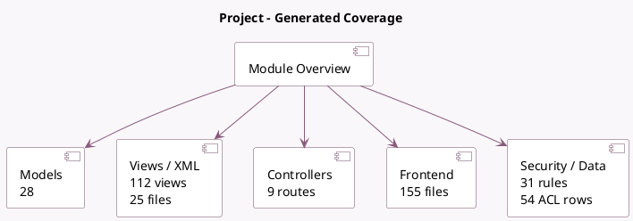

<!-- GENERATED:MODULE -->
---
tags: [odoo, community, module]
---

# Project

- Scope: Community Addons
- Source: odoo/addons/project
- Dependencies: [[docs/Community Addons/analytic/analytic|analytic]], [[docs/Community Addons/base_setup/base_setup|base_setup]], [[docs/Community Addons/mail/mail|mail]], [[docs/Community Addons/portal/portal|portal]], [[docs/Community Addons/rating/rating|rating]], [[docs/Community Addons/resource/resource|resource]], [[docs/Community Addons/web/web|web]], [[docs/Community Addons/web_tour/web_tour|web_tour]], [[docs/Community Addons/digest/digest|digest]]

## Summary

Organize and plan your projects

## Generated coverage

- Models: 28
- XML files with UI/data artifacts: 25
- Views: 112
- Actions: 109
- Menus: 19
- Rules (ir.rule): 31
- Access CSV entries: 54
- Controller units: 1
- Frontend asset files: 155

## Module map

## Detail notes

- Models: [[docs/Community Addons/project/Models|Models]] (28)
- Views and XML: [[docs/Community Addons/project/Views|Views]] (25 files)
- Controllers: [[docs/Community Addons/project/Controllers|Controllers]] (1)
- Frontend: [[docs/Community Addons/project/Frontend|Frontend]] (155 files)

## Key models

- `account.analytic.account`
- `digest.digest`
- `ir.ui.menu`
- `mail.message`
- `portal.share`
- `project.collaborator`
- `project.milestone`
- `project.project`
- `project.project.stage`
- `project.project.stage.delete.wizard`
- `project.role`
- `project.share.collaborator.wizard`

## Navigation

- [[../Community Addons/Community Addons|Back to scope]]
- [[../../docs/docs|Back to docs]]

<!-- GENERATED:MODULE -->

## Curated analysis

### Functional role
- `project` is the services execution workspace: projects, tasks, updates, milestones, roles, collaborators, and portal sharing all converge here.
- It is one of the clearest examples of a module that mixes business flow, mail/thread behavior, ratings, portal access, and reporting in the same functional surface.

### Operational footprint
- `project_project.py`, `project_task.py`, and `project_update.py` hold the core orchestration for project state, task lifecycle, and stakeholder updates.
- The module ships broad UI and security coverage, including burndown reporting, sharing views, cron data, and a dense set of record rules in `security/project_security.xml`.

### Evidence
- Source files: `odoo19/addons/project/models/project_project.py`, `odoo19/addons/project/models/project_task.py`, `odoo19/addons/project/models/project_update.py`
- UI and automation: `odoo19/addons/project/views/project_project_views.xml`, `odoo19/addons/project/views/project_task_views.xml`, `odoo19/addons/project/data/ir_cron_data.xml`
- Security and tests: `odoo19/addons/project/security/project_security.xml`, `odoo19/addons/project/tests/test_access_rights.py`, `odoo19/addons/project/tests/test_burndown_chart.py`

### Related notes
- `[[docs/Core/Processes/Projects/Projects]]`
- `[[docs/Community Addons/portal/portal|portal]]`

### Risks and follow-up
- Access control is a first-class concern here; portal sharing and collaborator rules need to be reviewed before exposing customer projects externally.
- The analytic-account link means configuration mistakes can leak into billing, profitability, and resource reporting even when users think they are only moving tasks.
- Legacy comparison backlog was retired on 2026-03-02; keep this note focused on the current codebase.

