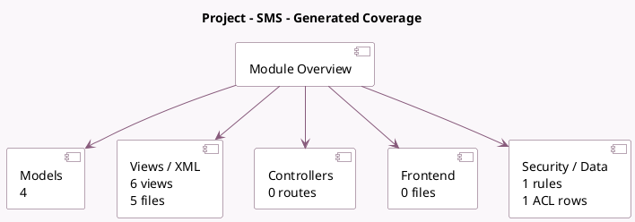

<!-- GENERATED:MODULE -->
---
tags: [odoo, community, module]
---

# Project - SMS

- Scope: Community Addons
- Source: odoo/addons/project_sms
- Dependencies: [[docs/Community Addons/project/project|project]], [[docs/Community Addons/sms/sms|sms]]

## Summary

Send text messages when project/task stage move

## Generated coverage

- Models: 4
- XML files with UI/data artifacts: 5
- Views: 6
- Actions: 2
- Menus: 0
- Rules (ir.rule): 1
- Access CSV entries: 1
- Controller units: 0
- Frontend asset files: 0

## Module map

## Detail notes

- Models: [[docs/Community Addons/project_sms/Models|Models]] (4)
- Views and XML: [[docs/Community Addons/project_sms/Views|Views]] (5 files)

## Key models

- `project.project`
- `project.project.stage`
- `project.task`
- `project.task.type`

## Navigation

- [[../Community Addons/Community Addons|Back to scope]]
- [[../../docs/docs|Back to docs]]

<!-- GENERATED:MODULE -->

