<!-- GENERATED:MODEL -->
---
tags: [odoo, community, generated, model]
---

# account.analytic.line

- Module: [[docs/Community Addons/project_timesheet_holidays/project_timesheet_holidays|project_timesheet_holidays]]
- Scope: Community Addons
- Defined in module: extension only
- Source files: `models/account_analytic.py`
- Python classes: `AccountAnalyticLine`

## Field footprint

- Detected fields: 3
- Field types: `Many2one` x 3
- Relation fields: 3

## Sample fields

- `global_leave_id`: `Many2one` (comodel `resource.calendar.leaves`)
- `holiday_id`: `Many2one` (comodel `hr.leave`)
- `task_id`: `Many2one`

## Method hints

- Detected methods: 5
- Action methods: none
- Compute methods: none
- Onchange methods: none

## Direct relation diagram

```plantuml
@startuml
!define ODOO_COLOR_PRIMARY #714B67
!define ODOO_COLOR_ACCENT #875A7B
!define ODOO_COLOR_BG #FAF7FA

skinparam backgroundColor ODOO_COLOR_BG
skinparam defaultTextAlignment left
skinparam ArrowColor ODOO_COLOR_ACCENT
skinparam ClassBackgroundColor white
skinparam ClassBorderColor ODOO_COLOR_PRIMARY
skinparam ComponentBackgroundColor white
skinparam ComponentBorderColor ODOO_COLOR_PRIMARY
skinparam NoteBackgroundColor #FFF8FF
skinparam NoteBorderColor ODOO_COLOR_ACCENT
skinparam SequenceLifeLineBorderColor ODOO_COLOR_ACCENT
skinparam SequenceLifeLineBackgroundColor #FFFFFF
skinparam SequenceParticipantBorderColor ODOO_COLOR_PRIMARY
skinparam SequenceParticipantBackgroundColor #FFFFFF
skinparam sequence {
  ArrowColor ODOO_COLOR_ACCENT
  ActorBorderColor ODOO_COLOR_PRIMARY
}
title account.analytic.line - Direct Relations
class "account.analytic.line" as account_analytic_line
class "hr.leave" as hr_leave
class "resource.calendar.leaves" as resource_calendar_leaves
account_analytic_line --> hr_leave : holiday_id
account_analytic_line --> resource_calendar_leaves : global_leave_id
@enduml
```

## Navigation

- **Parent:** [[docs/Community Addons/project_timesheet_holidays/Models]]

<!-- GENERATED:MODEL -->
