<!-- GENERATED:MODEL -->
---
tags: [odoo, community, generated, model]
---

# resource.calendar.leaves

- Module: [[docs/Community Addons/project_timesheet_holidays/project_timesheet_holidays|project_timesheet_holidays]]
- Scope: Community Addons
- Defined in module: extension only
- Source files: `models/resource_calendar_leaves.py`
- Python classes: `ResourceCalendarLeaves`

## Field footprint

- Detected fields: 1
- Field types: `One2many` x 1
- Relation fields: 1

## Sample fields

- `timesheet_ids`: `One2many` (comodel `account.analytic.line`)

## Method hints

- Detected methods: 8
- Action methods: none
- Compute methods: none
- Onchange methods: none

## Direct relation diagram

```plantuml
@startuml
!define ODOO_COLOR_PRIMARY #714B67
!define ODOO_COLOR_ACCENT #875A7B
!define ODOO_COLOR_BG #FAF7FA

skinparam backgroundColor ODOO_COLOR_BG
skinparam defaultTextAlignment left
skinparam ArrowColor ODOO_COLOR_ACCENT
skinparam ClassBackgroundColor white
skinparam ClassBorderColor ODOO_COLOR_PRIMARY
skinparam ComponentBackgroundColor white
skinparam ComponentBorderColor ODOO_COLOR_PRIMARY
skinparam NoteBackgroundColor #FFF8FF
skinparam NoteBorderColor ODOO_COLOR_ACCENT
skinparam SequenceLifeLineBorderColor ODOO_COLOR_ACCENT
skinparam SequenceLifeLineBackgroundColor #FFFFFF
skinparam SequenceParticipantBorderColor ODOO_COLOR_PRIMARY
skinparam SequenceParticipantBackgroundColor #FFFFFF
skinparam sequence {
  ArrowColor ODOO_COLOR_ACCENT
  ActorBorderColor ODOO_COLOR_PRIMARY
}
title resource.calendar.leaves - Direct Relations
class "resource.calendar.leaves" as resource_calendar_leaves
class "account.analytic.line" as account_analytic_line
resource_calendar_leaves --|> account_analytic_line : timesheet_ids
@enduml
```

## Navigation

- **Parent:** [[docs/Community Addons/project_timesheet_holidays/Models]]

<!-- GENERATED:MODEL -->
