<!-- GENERATED:MODEL -->
---
tags: [odoo, community, generated, model]
---

# account.move

- Module: [[docs/Community Addons/purchase/purchase|purchase]]
- Scope: Community Addons
- Defined in module: extension only
- Source files: `models/account_invoice.py`
- Python classes: `AccountMove`

## Field footprint

- Detected fields: 6
- Field types: `Boolean` x 1, `Char` x 1, `Integer` x 1, `Many2one` x 2, `Text` x 1
- Relation fields: 2

## Sample fields

- `is_purchase_matched`: `Boolean` (compute `_compute_is_purchase_matched`)
- `purchase_id`: `Many2one` (comodel `purchase.order`, store `False`)
- `purchase_order_count`: `Integer` (compute `_compute_origin_po_count`)
- `purchase_order_name`: `Char` (compute `_compute_purchase_order_name`)
- `purchase_vendor_bill_id`: `Many2one` (comodel `purchase.bill.union`, store `False`)
- `purchase_warning_text`: `Text` (comodel `Purchase Warning`, compute `_compute_purchase_warning_text`)

## Method hints

- Detected methods: 16
- Action methods: `action_purchase_matching`, `action_view_source_purchase_orders`
- Compute methods: `_compute_is_purchase_matched`, `_compute_origin_po_count`, `_compute_purchase_order_name`, `_compute_purchase_warning_text`
- Onchange methods: `_onchange_partner_id`, `_onchange_purchase_auto_complete`

## Direct relation diagram

```plantuml
@startuml
!define ODOO_COLOR_PRIMARY #714B67
!define ODOO_COLOR_ACCENT #875A7B
!define ODOO_COLOR_BG #FAF7FA

skinparam backgroundColor ODOO_COLOR_BG
skinparam defaultTextAlignment left
skinparam ArrowColor ODOO_COLOR_ACCENT
skinparam ClassBackgroundColor white
skinparam ClassBorderColor ODOO_COLOR_PRIMARY
skinparam ComponentBackgroundColor white
skinparam ComponentBorderColor ODOO_COLOR_PRIMARY
skinparam NoteBackgroundColor #FFF8FF
skinparam NoteBorderColor ODOO_COLOR_ACCENT
skinparam SequenceLifeLineBorderColor ODOO_COLOR_ACCENT
skinparam SequenceLifeLineBackgroundColor #FFFFFF
skinparam SequenceParticipantBorderColor ODOO_COLOR_PRIMARY
skinparam SequenceParticipantBackgroundColor #FFFFFF
skinparam sequence {
  ArrowColor ODOO_COLOR_ACCENT
  ActorBorderColor ODOO_COLOR_PRIMARY
}
title account.move - Direct Relations
class "account.move" as account_move
class "purchase.bill.union" as purchase_bill_union
class "purchase.order" as purchase_order
account_move --> purchase_bill_union : purchase_vendor_bill_id
account_move --> purchase_order : purchase_id
@enduml
```

## Navigation

- **Parent:** [[docs/Community Addons/purchase/Models]]

<!-- GENERATED:MODEL -->
