<!-- GENERATED:MODEL -->
---
tags: [odoo, community, generated, model]
---

# bill.to.po.wizard

- Module: [[docs/Community Addons/purchase/purchase|purchase]]
- Scope: Community Addons
- Defined in module: yes
- Source files: `wizard/bill_to_po_wizard.py`
- Python classes: `BillToPoWizard`
- Description: Bill to Purchase Order

## Field footprint

- Detected fields: 2
- Field types: `Many2one` x 2
- Relation fields: 2

## Sample fields

- `partner_id`: `Many2one` (comodel `res.partner`)
- `purchase_order_id`: `Many2one` (comodel `purchase.order`)

## Method hints

- Detected methods: 2
- Action methods: `action_add_downpayment`, `action_add_to_po`
- Compute methods: none
- Onchange methods: none

## Direct relation diagram

```plantuml
@startuml
!define ODOO_COLOR_PRIMARY #714B67
!define ODOO_COLOR_ACCENT #875A7B
!define ODOO_COLOR_BG #FAF7FA

skinparam backgroundColor ODOO_COLOR_BG
skinparam defaultTextAlignment left
skinparam ArrowColor ODOO_COLOR_ACCENT
skinparam ClassBackgroundColor white
skinparam ClassBorderColor ODOO_COLOR_PRIMARY
skinparam ComponentBackgroundColor white
skinparam ComponentBorderColor ODOO_COLOR_PRIMARY
skinparam NoteBackgroundColor #FFF8FF
skinparam NoteBorderColor ODOO_COLOR_ACCENT
skinparam SequenceLifeLineBorderColor ODOO_COLOR_ACCENT
skinparam SequenceLifeLineBackgroundColor #FFFFFF
skinparam SequenceParticipantBorderColor ODOO_COLOR_PRIMARY
skinparam SequenceParticipantBackgroundColor #FFFFFF
skinparam sequence {
  ArrowColor ODOO_COLOR_ACCENT
  ActorBorderColor ODOO_COLOR_PRIMARY
}
title bill.to.po.wizard - Direct Relations
class "bill.to.po.wizard" as bill_to_po_wizard
class "purchase.order" as purchase_order
class "res.partner" as res_partner
bill_to_po_wizard --> purchase_order : purchase_order_id
bill_to_po_wizard --> res_partner : partner_id
@enduml
```

## Navigation

- **Parent:** [[docs/Community Addons/purchase/Models]]

<!-- GENERATED:MODEL -->
