<!-- GENERATED:MODEL -->
---
tags: [odoo, community, generated, model]
---

# purchase.bill.line.match

- Module: [[docs/Community Addons/purchase/purchase|purchase]]
- Scope: Community Addons
- Defined in module: yes
- Source files: `models/purchase_bill_line_match.py`
- Python classes: `PurchaseBillLineMatch`
- Description: Purchase Line and Vendor Bill line matching view

## Field footprint

- Detected fields: 20
- Field types: `Char` x 2, `Float` x 5, `Many2one` x 10, `Monetary` x 3
- Relation fields: 10

## Sample fields

- `account_move_id`: `Many2one` (comodel `account.move`)
- `aml_id`: `Many2one` (comodel `account.move.line`)
- `billed_amount_untaxed`: `Monetary` (compute `_compute_amount_untaxed_fields`)
- `company_id`: `Many2one` (comodel `res.company`)
- `currency_id`: `Many2one` (comodel `res.currency`)
- `line_amount_untaxed`: `Monetary`
- `line_qty`: `Float`
- `line_uom_id`: `Many2one` (comodel `uom.uom`)
- `partner_id`: `Many2one` (comodel `res.partner`)
- `pol_id`: `Many2one` (comodel `purchase.order.line`)
- `product_id`: `Many2one` (comodel `product.product`)
- `product_uom_id`: `Many2one` (comodel `uom.uom`, related `product_id.uom_id`)
- `product_uom_price`: `Float` (compute `_compute_product_uom_price`)
- `product_uom_qty`: `Float` (compute `_compute_product_uom_qty`)
- `purchase_amount_untaxed`: `Monetary` (compute `_compute_amount_untaxed_fields`)
- `purchase_order_id`: `Many2one` (comodel `purchase.order`)
- `qty_invoiced`: `Float`
- `qty_to_invoice`: `Float` (comodel `Qty to invoice`)
- `reference`: `Char` (compute `_compute_reference`)
- `state`: `Char`

## Method hints

- Detected methods: 14
- Action methods: `action_add_to_po`, `action_match_lines`, `action_open_line`
- Compute methods: `_compute_amount_untaxed_fields`, `_compute_display_name`, `_compute_product_uom_price`, `_compute_product_uom_qty`, `_compute_reference`
- Onchange methods: `_inverse_product_uom_price`, `_inverse_product_uom_qty`

## Direct relation diagram

```plantuml
@startuml
!define ODOO_COLOR_PRIMARY #714B67
!define ODOO_COLOR_ACCENT #875A7B
!define ODOO_COLOR_BG #FAF7FA

skinparam backgroundColor ODOO_COLOR_BG
skinparam defaultTextAlignment left
skinparam ArrowColor ODOO_COLOR_ACCENT
skinparam ClassBackgroundColor white
skinparam ClassBorderColor ODOO_COLOR_PRIMARY
skinparam ComponentBackgroundColor white
skinparam ComponentBorderColor ODOO_COLOR_PRIMARY
skinparam NoteBackgroundColor #FFF8FF
skinparam NoteBorderColor ODOO_COLOR_ACCENT
skinparam SequenceLifeLineBorderColor ODOO_COLOR_ACCENT
skinparam SequenceLifeLineBackgroundColor #FFFFFF
skinparam SequenceParticipantBorderColor ODOO_COLOR_PRIMARY
skinparam SequenceParticipantBackgroundColor #FFFFFF
skinparam sequence {
  ArrowColor ODOO_COLOR_ACCENT
  ActorBorderColor ODOO_COLOR_PRIMARY
}
title purchase.bill.line.match - Direct Relations
class "purchase.bill.line.match" as purchase_bill_line_match
class "account.move" as account_move
class "account.move.line" as account_move_line
class "product.product" as product_product
class "purchase.order" as purchase_order
class "purchase.order.line" as purchase_order_line
class "res.company" as res_company
class "res.currency" as res_currency
class "res.partner" as res_partner
class "uom.uom" as uom_uom
purchase_bill_line_match --> purchase_order_line : pol_id
purchase_bill_line_match --> account_move_line : aml_id
purchase_bill_line_match --> res_company : company_id
purchase_bill_line_match --> res_partner : partner_id
purchase_bill_line_match --> product_product : product_id
purchase_bill_line_match --> uom_uom : line_uom_id
purchase_bill_line_match --> purchase_order : purchase_order_id
purchase_bill_line_match --> account_move : account_move_id
purchase_bill_line_match --> res_currency : currency_id
purchase_bill_line_match --> uom_uom : product_uom_id
@enduml
```

## Navigation

- **Parent:** [[docs/Community Addons/purchase/Models]]

<!-- GENERATED:MODEL -->
