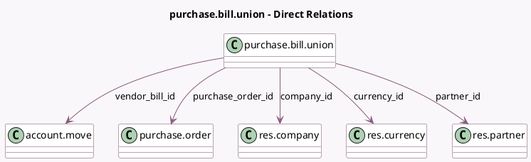

<!-- GENERATED:MODEL -->
---
tags: [odoo, community, generated, model]
---

# purchase.bill.union

- Module: [[docs/Community Addons/purchase/purchase|purchase]]
- Scope: Community Addons
- Defined in module: yes
- Source files: `report/purchase_bill.py`
- Python classes: `PurchaseBillUnion`
- Description: Purchases & Bills Union

## Field footprint

- Detected fields: 9
- Field types: `Char` x 2, `Date` x 1, `Float` x 1, `Many2one` x 5
- Relation fields: 5

## Sample fields

- `amount`: `Float`
- `company_id`: `Many2one` (comodel `res.company`)
- `currency_id`: `Many2one` (comodel `res.currency`)
- `date`: `Date`
- `name`: `Char`
- `partner_id`: `Many2one` (comodel `res.partner`)
- `purchase_order_id`: `Many2one` (comodel `purchase.order`)
- `reference`: `Char`
- `vendor_bill_id`: `Many2one` (comodel `account.move`)

## Method hints

- Detected methods: 2
- Action methods: none
- Compute methods: `_compute_display_name`
- Onchange methods: none

## Direct relation diagram

## Navigation

- **Parent:** [[docs/Community Addons/purchase/Models]]

<!-- GENERATED:MODEL -->
