<!-- GENERATED:MODEL -->
---
tags: [odoo, community, generated, model]
---

# purchase.order.line

- Module: [[docs/Community Addons/purchase/purchase|purchase]]
- Scope: Community Addons
- Defined in module: yes
- Source files: `models/purchase_order_line.py`
- Python classes: `PurchaseOrderLine`
- Description: Purchase Order Line
- Inherits: `analytic.mixin`

## Field footprint

- Detected fields: 38
- Field types: `Boolean` x 1, `Datetime` x 3, `Float` x 11, `Integer` x 1, `Many2many` x 4, `Many2one` x 8, `Monetary` x 2, `One2many` x 1, `Selection` x 5, `Text` x 2
- Relation fields: 13

## Sample fields

- `allowed_uom_ids`: `Many2many` (comodel `uom.uom`, compute `_compute_allowed_uom_ids`)
- `company_id`: `Many2one` (comodel `res.company`, related `order_id.company_id`, store `True`)
- `currency_id`: `Many2one` (related `order_id.currency_id`)
- `date_approve`: `Datetime` (related `order_id.date_approve`)
- `date_order`: `Datetime` (related `order_id.date_order`)
- `date_planned`: `Datetime` (compute `_compute_price_unit_and_date_planned_and_name`, store `True`)
- `discount`: `Float` (compute `_compute_price_unit_and_date_planned_and_name`, store `True`)
- `display_type`: `Selection`
- `invoice_lines`: `One2many` (comodel `account.move.line`)
- `is_downpayment`: `Boolean`
- `name`: `Text` (compute `_compute_price_unit_and_date_planned_and_name`, store `True`)
- `order_id`: `Many2one` (comodel `purchase.order`)
- `parent_id`: `Many2one` (comodel `purchase.order.line`, compute `_compute_parent_id`)
- `partner_id`: `Many2one` (comodel `res.partner`, related `order_id.partner_id`, store `True`)
- `price_subtotal`: `Monetary` (compute `_compute_amount`, store `True`)
- `price_tax`: `Float` (compute `_compute_amount`, store `True`)
- `price_total`: `Monetary` (compute `_compute_amount`, store `True`)
- `price_unit`: `Float` (compute `_compute_price_unit_and_date_planned_and_name`, store `True`)
- `price_unit_discounted`: `Float` (comodel `Unit Price (Discounted)`, compute `_compute_price_unit_discounted`)
- `product_id`: `Many2one` (comodel `product.product`)

## Method hints

- Detected methods: 37
- Action methods: `action_add_from_catalog`, `action_open_order`
- Compute methods: `_compute_allowed_uom_ids`, `_compute_amount`, `_compute_analytic_distribution`, `_compute_parent_id`, `_compute_price_unit_and_date_planned_and_name`, `_compute_price_unit_discounted`, `_compute_product_uom_qty`, `_compute_qty_invoiced`, and 4 more
- Onchange methods: `_inverse_qty_received`, `onchange_product_id`

## Direct relation diagram

```plantuml
@startuml
!define ODOO_COLOR_PRIMARY #714B67
!define ODOO_COLOR_ACCENT #875A7B
!define ODOO_COLOR_BG #FAF7FA

skinparam backgroundColor ODOO_COLOR_BG
skinparam defaultTextAlignment left
skinparam ArrowColor ODOO_COLOR_ACCENT
skinparam ClassBackgroundColor white
skinparam ClassBorderColor ODOO_COLOR_PRIMARY
skinparam ComponentBackgroundColor white
skinparam ComponentBorderColor ODOO_COLOR_PRIMARY
skinparam NoteBackgroundColor #FFF8FF
skinparam NoteBorderColor ODOO_COLOR_ACCENT
skinparam SequenceLifeLineBorderColor ODOO_COLOR_ACCENT
skinparam SequenceLifeLineBackgroundColor #FFFFFF
skinparam SequenceParticipantBorderColor ODOO_COLOR_PRIMARY
skinparam SequenceParticipantBackgroundColor #FFFFFF
skinparam sequence {
  ArrowColor ODOO_COLOR_ACCENT
  ActorBorderColor ODOO_COLOR_PRIMARY
}
title purchase.order.line - Direct Relations
class "purchase.order.line" as purchase_order_line
class "account.move.line" as account_move_line
class "account.tax" as account_tax
class "product.product" as product_product
class "product.supplierinfo" as product_supplierinfo
class "product.template.attribute.value" as product_template_attribute_value
class "purchase.order" as purchase_order
class "purchase.order.line" as purchase_order_line
class "res.company" as res_company
class "res.partner" as res_partner
class "uom.uom" as uom_uom
purchase_order_line .. account_tax : tax_ids
purchase_order_line .. uom_uom : allowed_uom_ids
purchase_order_line --> uom_uom : product_uom_id
purchase_order_line --> product_product : product_id
purchase_order_line --> purchase_order : order_id
purchase_order_line --> res_company : company_id
purchase_order_line --|> account_move_line : invoice_lines
purchase_order_line --> res_partner : partner_id
purchase_order_line --> product_supplierinfo : selected_seller_id
purchase_order_line .. product_template_attribute_value : product_no_variant_attribute_value_ids
purchase_order_line --> purchase_order_line : parent_id
@enduml
```

## Navigation

- **Parent:** [[docs/Community Addons/purchase/Models]]

<!-- GENERATED:MODEL -->
