<!-- GENERATED:MODEL -->
---
tags: [odoo, community, generated, model]
---

# purchase.order

- Module: [[docs/Community Addons/purchase/purchase|purchase]]
- Scope: Community Addons
- Defined in module: yes
- Source files: `models/purchase_order.py`
- Python classes: `PurchaseOrder`
- Description: Purchase Order
- Inherits: `account.document.import.mixin`, `mail.activity.mixin`, `mail.thread`, `portal.mixin`, `product.catalog.mixin`

## Field footprint

- Detected fields: 44
- Field types: `Binary` x 1, `Boolean` x 5, `Char` x 4, `Datetime` x 4, `Float` x 1, `Html` x 1, `Integer` x 3, `Many2many` x 2, `Many2one` x 11, `Monetary` x 4, `One2many` x 1, `Selection` x 6, `Text` x 1
- Relation fields: 14

## Sample fields

- `acknowledged`: `Boolean` (comodel `Acknowledged`)
- `amount_tax`: `Monetary` (compute `_amount_all`, store `True`)
- `amount_total`: `Monetary` (compute `_amount_all`, store `True`)
- `amount_total_cc`: `Monetary` (compute `_amount_all`, store `True`)
- `amount_untaxed`: `Monetary` (compute `_amount_all`, store `True`)
- `company_currency_id`: `Many2one` (related `company_id.currency_id`)
- `company_id`: `Many2one` (comodel `res.company`)
- `company_price_include`: `Selection` (related `company_id.account_price_include`)
- `country_code`: `Char` (related `company_id.account_fiscal_country_id.code`)
- `currency_id`: `Many2one` (comodel `res.currency`, compute `_compute_currency_id`, store `True`)
- `currency_rate`: `Float` (compute `_compute_currency_rate`, store `True`)
- `date_approve`: `Datetime` (comodel `Confirmation Date`)
- `date_calendar_start`: `Datetime` (compute `_compute_date_calendar_start`, store `True`)
- `date_order`: `Datetime` (comodel `Order Deadline`)
- `date_planned`: `Datetime` (compute `_compute_date_planned`, store `True`)
- `dest_address_id`: `Many2one` (comodel `res.partner`)
- `duplicated_order_ids`: `Many2many` (comodel `purchase.order`, compute `_compute_duplicated_order_ids`)
- `fiscal_position_id`: `Many2one` (comodel `account.fiscal.position`)
- `incoterm_id`: `Many2one` (comodel `account.incoterms`)
- `invoice_count`: `Integer` (compute `_compute_invoice`, store `True`)

## Method hints

- Detected methods: 83
- Action methods: `action_acknowledge`, `action_add_from_catalog`, `action_bill_matching`, `action_create_invoice`, `action_merge`, `action_open_business_doc`, `action_purchase_comparison`, `action_rfq_send`, and 1 more
- Compute methods: `_compute_access_url`, `_compute_amount_total_cc`, `_compute_currency_id`, `_compute_currency_rate`, `_compute_date_calendar_start`, `_compute_date_planned`, `_compute_display_name`, `_compute_duplicated_order_ids`, and 7 more
- Onchange methods: `_compute_tax_id`, `onchange_date_planned`, `onchange_partner_id`

## Direct relation diagram

```plantuml
@startuml
!define ODOO_COLOR_PRIMARY #714B67
!define ODOO_COLOR_ACCENT #875A7B
!define ODOO_COLOR_BG #FAF7FA

skinparam backgroundColor ODOO_COLOR_BG
skinparam defaultTextAlignment left
skinparam ArrowColor ODOO_COLOR_ACCENT
skinparam ClassBackgroundColor white
skinparam ClassBorderColor ODOO_COLOR_PRIMARY
skinparam ComponentBackgroundColor white
skinparam ComponentBorderColor ODOO_COLOR_PRIMARY
skinparam NoteBackgroundColor #FFF8FF
skinparam NoteBorderColor ODOO_COLOR_ACCENT
skinparam SequenceLifeLineBorderColor ODOO_COLOR_ACCENT
skinparam SequenceLifeLineBackgroundColor #FFFFFF
skinparam SequenceParticipantBorderColor ODOO_COLOR_PRIMARY
skinparam SequenceParticipantBackgroundColor #FFFFFF
skinparam sequence {
  ArrowColor ODOO_COLOR_ACCENT
  ActorBorderColor ODOO_COLOR_PRIMARY
}
title purchase.order - Direct Relations
class "purchase.order" as purchase_order
class "account.fiscal.position" as account_fiscal_position
class "account.incoterms" as account_incoterms
class "account.move" as account_move
class "account.payment.term" as account_payment_term
class "product.product" as product_product
class "purchase.order" as purchase_order
class "purchase.order.line" as purchase_order_line
class "res.company" as res_company
class "res.country" as res_country
class "res.currency" as res_currency
class "res.partner" as res_partner
class "res.users" as res_users
purchase_order --> res_partner : partner_id
purchase_order --> res_partner : dest_address_id
purchase_order --> res_currency : currency_id
purchase_order --|> purchase_order_line : order_line
purchase_order .. account_move : invoice_ids
purchase_order --> account_fiscal_position : fiscal_position_id
purchase_order --> res_country : tax_country_id
purchase_order --> account_payment_term : payment_term_id
purchase_order --> account_incoterms : incoterm_id
purchase_order --> product_product : product_id
purchase_order --> res_users : user_id
purchase_order --> res_company : company_id
purchase_order .. purchase_order : duplicated_order_ids
@enduml
```

## Navigation

- **Parent:** [[docs/Community Addons/purchase/Models]]

<!-- GENERATED:MODEL -->
