<!-- GENERATED:MODEL -->
---
tags: [odoo, community, generated, model]
---

# purchase.report

- Module: [[docs/Community Addons/purchase/purchase|purchase]]
- Scope: Community Addons
- Defined in module: yes
- Source files: `report/purchase_report.py`
- Python classes: `PurchaseReport`
- Description: Purchase Report

## Field footprint

- Detected fields: 27
- Field types: `Datetime` x 2, `Float` x 8, `Integer` x 1, `Many2one` x 12, `Monetary` x 3, `Selection` x 1
- Relation fields: 12

## Sample fields

- `category_id`: `Many2one` (comodel `product.category`)
- `commercial_partner_id`: `Many2one` (comodel `res.partner`)
- `company_id`: `Many2one` (comodel `res.company`)
- `country_id`: `Many2one` (comodel `res.country`)
- `currency_id`: `Many2one` (comodel `res.currency`)
- `date_approve`: `Datetime` (comodel `Confirmation Date`)
- `date_order`: `Datetime` (comodel `Order Date`)
- `delay`: `Float` (comodel `Days to Confirm`)
- `delay_pass`: `Float` (comodel `Days to Receive`)
- `fiscal_position_id`: `Many2one` (comodel `account.fiscal.position`)
- `nbr_lines`: `Integer` (comodel `# of Lines`)
- `order_id`: `Many2one` (comodel `purchase.order`)
- `partner_id`: `Many2one` (comodel `res.partner`)
- `price_average`: `Monetary` (comodel `Average Cost`)
- `price_total`: `Monetary` (comodel `Total`)
- `product_id`: `Many2one` (comodel `product.product`)
- `product_tmpl_id`: `Many2one` (comodel `product.template`)
- `product_uom_id`: `Many2one` (comodel `uom.uom`)
- `qty_billed`: `Float` (comodel `Qty Billed`)
- `qty_ordered`: `Float` (comodel `Qty Ordered`)

## Method hints

- Detected methods: 6
- Action methods: none
- Compute methods: none
- Onchange methods: none

## Direct relation diagram

```plantuml
@startuml
!define ODOO_COLOR_PRIMARY #714B67
!define ODOO_COLOR_ACCENT #875A7B
!define ODOO_COLOR_BG #FAF7FA

skinparam backgroundColor ODOO_COLOR_BG
skinparam defaultTextAlignment left
skinparam ArrowColor ODOO_COLOR_ACCENT
skinparam ClassBackgroundColor white
skinparam ClassBorderColor ODOO_COLOR_PRIMARY
skinparam ComponentBackgroundColor white
skinparam ComponentBorderColor ODOO_COLOR_PRIMARY
skinparam NoteBackgroundColor #FFF8FF
skinparam NoteBorderColor ODOO_COLOR_ACCENT
skinparam SequenceLifeLineBorderColor ODOO_COLOR_ACCENT
skinparam SequenceLifeLineBackgroundColor #FFFFFF
skinparam SequenceParticipantBorderColor ODOO_COLOR_PRIMARY
skinparam SequenceParticipantBackgroundColor #FFFFFF
skinparam sequence {
  ArrowColor ODOO_COLOR_ACCENT
  ActorBorderColor ODOO_COLOR_PRIMARY
}
title purchase.report - Direct Relations
class "purchase.report" as purchase_report
class "account.fiscal.position" as account_fiscal_position
class "product.category" as product_category
class "product.product" as product_product
class "product.template" as product_template
class "purchase.order" as purchase_order
class "res.company" as res_company
class "res.country" as res_country
class "res.currency" as res_currency
class "res.partner" as res_partner
class "res.users" as res_users
class "uom.uom" as uom_uom
purchase_report --> product_product : product_id
purchase_report --> res_partner : partner_id
purchase_report --> uom_uom : product_uom_id
purchase_report --> res_company : company_id
purchase_report --> res_currency : currency_id
purchase_report --> res_users : user_id
purchase_report --> product_category : category_id
purchase_report --> product_template : product_tmpl_id
purchase_report --> res_country : country_id
purchase_report --> account_fiscal_position : fiscal_position_id
purchase_report --> res_partner : commercial_partner_id
purchase_report --> purchase_order : order_id
@enduml
```

## Navigation

- **Parent:** [[docs/Community Addons/purchase/Models]]

<!-- GENERATED:MODEL -->
