<!-- GENERATED:MODEL -->
---
tags: [odoo, community, generated, model]
---

# res.config.settings

- Module: [[docs/Community Addons/purchase/purchase|purchase]]
- Scope: Community Addons
- Defined in module: extension only
- Source files: `models/res_config_settings.py`
- Python classes: `ResConfigSettings`

## Field footprint

- Detected fields: 11
- Field types: `Boolean` x 7, `Many2one` x 1, `Monetary` x 1, `Selection` x 2
- Relation fields: 1

## Sample fields

- `company_currency_id`: `Many2one` (comodel `res.currency`, related `company_id.currency_id`)
- `group_send_reminder`: `Boolean` (comodel `Receipt Reminder`)
- `group_warning_purchase`: `Boolean` (comodel `Purchase Warnings`)
- `lock_confirmed_po`: `Boolean` (comodel `Lock Confirmed Orders`)
- `module_account_3way_match`: `Boolean` (comodel `3-way matching: purchases, receptions and bills`)
- `module_purchase_product_matrix`: `Boolean` (comodel `Purchase Grid Entry`)
- `module_purchase_requisition`: `Boolean` (comodel `Purchase Agreements`)
- `po_double_validation`: `Selection` (related `company_id.po_double_validation`)
- `po_double_validation_amount`: `Monetary` (related `company_id.po_double_validation_amount`)
- `po_lock`: `Selection` (related `company_id.po_lock`)
- `po_order_approval`: `Boolean` (comodel `Purchase Order Approval`)

## Method hints

- Detected methods: 3
- Action methods: none
- Compute methods: none
- Onchange methods: `_onchange_group_product_variant_purchase`, `_onchange_module_purchase_product_matrix`

## Direct relation diagram

```plantuml
@startuml
!define ODOO_COLOR_PRIMARY #714B67
!define ODOO_COLOR_ACCENT #875A7B
!define ODOO_COLOR_BG #FAF7FA

skinparam backgroundColor ODOO_COLOR_BG
skinparam defaultTextAlignment left
skinparam ArrowColor ODOO_COLOR_ACCENT
skinparam ClassBackgroundColor white
skinparam ClassBorderColor ODOO_COLOR_PRIMARY
skinparam ComponentBackgroundColor white
skinparam ComponentBorderColor ODOO_COLOR_PRIMARY
skinparam NoteBackgroundColor #FFF8FF
skinparam NoteBorderColor ODOO_COLOR_ACCENT
skinparam SequenceLifeLineBorderColor ODOO_COLOR_ACCENT
skinparam SequenceLifeLineBackgroundColor #FFFFFF
skinparam SequenceParticipantBorderColor ODOO_COLOR_PRIMARY
skinparam SequenceParticipantBackgroundColor #FFFFFF
skinparam sequence {
  ArrowColor ODOO_COLOR_ACCENT
  ActorBorderColor ODOO_COLOR_PRIMARY
}
title res.config.settings - Direct Relations
class "res.config.settings" as res_config_settings
class "res.currency" as res_currency
res_config_settings --> res_currency : company_currency_id
@enduml
```

## Navigation

- **Parent:** [[docs/Community Addons/purchase/Models]]

<!-- GENERATED:MODEL -->
