<!-- GENERATED:MODEL -->
---
tags: [odoo, community, generated, model]
---

# res.partner

- Module: [[docs/Community Addons/purchase/purchase|purchase]]
- Scope: Community Addons
- Defined in module: extension only
- Source files: `models/res_partner.py`
- Python classes: `ResPartner`

## Field footprint

- Detected fields: 6
- Field types: `Boolean` x 1, `Integer` x 2, `Many2one` x 2, `Text` x 1
- Relation fields: 2

## Sample fields

- `buyer_id`: `Many2one` (comodel `res.users`)
- `property_purchase_currency_id`: `Many2one` (comodel `res.currency`)
- `purchase_order_count`: `Integer` (compute `_compute_purchase_order_count`)
- `purchase_warn_msg`: `Text` (comodel `Message for Purchase Order`)
- `receipt_reminder_email`: `Boolean` (comodel `Receipt Reminder`)
- `reminder_date_before_receipt`: `Integer` (comodel `Days Before Receipt`)

## Method hints

- Detected methods: 2
- Action methods: none
- Compute methods: `_compute_application_statistics_hook`, `_compute_purchase_order_count`
- Onchange methods: none

## Direct relation diagram

```plantuml
@startuml
!define ODOO_COLOR_PRIMARY #714B67
!define ODOO_COLOR_ACCENT #875A7B
!define ODOO_COLOR_BG #FAF7FA

skinparam backgroundColor ODOO_COLOR_BG
skinparam defaultTextAlignment left
skinparam ArrowColor ODOO_COLOR_ACCENT
skinparam ClassBackgroundColor white
skinparam ClassBorderColor ODOO_COLOR_PRIMARY
skinparam ComponentBackgroundColor white
skinparam ComponentBorderColor ODOO_COLOR_PRIMARY
skinparam NoteBackgroundColor #FFF8FF
skinparam NoteBorderColor ODOO_COLOR_ACCENT
skinparam SequenceLifeLineBorderColor ODOO_COLOR_ACCENT
skinparam SequenceLifeLineBackgroundColor #FFFFFF
skinparam SequenceParticipantBorderColor ODOO_COLOR_PRIMARY
skinparam SequenceParticipantBackgroundColor #FFFFFF
skinparam sequence {
  ArrowColor ODOO_COLOR_ACCENT
  ActorBorderColor ODOO_COLOR_PRIMARY
}
title res.partner - Direct Relations
class "res.partner" as res_partner
class "res.currency" as res_currency
class "res.users" as res_users
res_partner --> res_currency : property_purchase_currency_id
res_partner --> res_users : buyer_id
@enduml
```

## Navigation

- **Parent:** [[docs/Community Addons/purchase/Models]]

<!-- GENERATED:MODEL -->
