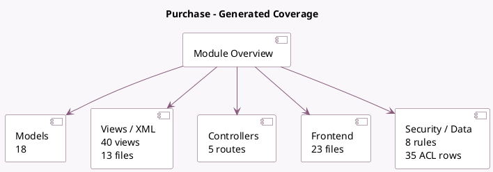

<!-- GENERATED:MODULE -->
---
tags: [odoo, community, module]
---

# Purchase

- Scope: Community Addons
- Source: odoo/addons/purchase
- Dependencies: [[docs/Community Addons/account/account|account]]

## Summary

Purchase orders, tenders and agreements

## Generated coverage

- Models: 18
- XML files with UI/data artifacts: 13
- Views: 40
- Actions: 18
- Menus: 18
- Rules (ir.rule): 8
- Access CSV entries: 35
- Controller units: 1
- Frontend asset files: 23

## Module map

## Detail notes

- Models: [[docs/Community Addons/purchase/Models|Models]] (18)
- Views and XML: [[docs/Community Addons/purchase/Views|Views]] (13 files)
- Controllers: [[docs/Community Addons/purchase/Controllers|Controllers]] (1)
- Frontend: [[docs/Community Addons/purchase/Frontend|Frontend]] (23 files)

## Key models

- `account.analytic.account`
- `account.analytic.applicability`
- `account.move`
- `account.move.line`
- `account.tax`
- `bill.to.po.wizard`
- `ir.actions.report`
- `product.product`
- `product.supplierinfo`
- `product.template`
- `purchase.bill.line.match`
- `purchase.bill.union`

## Navigation

- [[../Community Addons/Community Addons|Back to scope]]
- [[../../docs/docs|Back to docs]]

<!-- GENERATED:MODULE -->

