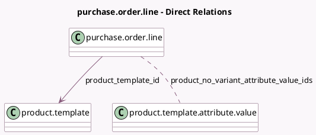

<!-- GENERATED:MODEL -->
---
tags: [odoo, community, generated, model]
---

# purchase.order.line

- Module: [[docs/Community Addons/purchase_product_matrix/purchase_product_matrix|purchase_product_matrix]]
- Scope: Community Addons
- Defined in module: extension only
- Source files: `models/purchase.py`
- Python classes: `PurchaseOrderLine`

## Field footprint

- Detected fields: 4
- Field types: `Boolean` x 1, `Many2many` x 2, `Many2one` x 1
- Relation fields: 3

## Sample fields

- `is_configurable_product`: `Boolean` (comodel `Is the product configurable?`, related `product_template_id.has_configurable_attributes`)
- `product_no_variant_attribute_value_ids`: `Many2many` (comodel `product.template.attribute.value`)
- `product_template_attribute_value_ids`: `Many2many` (related `product_id.product_template_attribute_value_ids`)
- `product_template_id`: `Many2one` (comodel `product.template`, related `product_id.product_tmpl_id`)

## Method hints

- Detected methods: 1
- Action methods: none
- Compute methods: none
- Onchange methods: none

## Direct relation diagram

## Navigation

- **Parent:** [[docs/Community Addons/purchase_product_matrix/Models]]

<!-- GENERATED:MODEL -->
