<!-- GENERATED:MODEL -->
---
tags: [odoo, community, generated, model]
---

# purchase.order

- Module: [[docs/Community Addons/purchase_product_matrix/purchase_product_matrix|purchase_product_matrix]]
- Scope: Community Addons
- Defined in module: extension only
- Source files: `models/purchase.py`
- Python classes: `PurchaseOrder`

## Field footprint

- Detected fields: 4
- Field types: `Boolean` x 2, `Char` x 1, `Many2one` x 1
- Relation fields: 1

## Sample fields

- `grid`: `Char` (store `False`)
- `grid_product_tmpl_id`: `Many2one` (comodel `product.template`, store `False`)
- `grid_update`: `Boolean` (store `False`)
- `report_grids`: `Boolean`

## Method hints

- Detected methods: 5
- Action methods: none
- Compute methods: none
- Onchange methods: `_apply_grid`, `_set_grid_up`

## Direct relation diagram

```plantuml
@startuml
!define ODOO_COLOR_PRIMARY #714B67
!define ODOO_COLOR_ACCENT #875A7B
!define ODOO_COLOR_BG #FAF7FA

skinparam backgroundColor ODOO_COLOR_BG
skinparam defaultTextAlignment left
skinparam ArrowColor ODOO_COLOR_ACCENT
skinparam ClassBackgroundColor white
skinparam ClassBorderColor ODOO_COLOR_PRIMARY
skinparam ComponentBackgroundColor white
skinparam ComponentBorderColor ODOO_COLOR_PRIMARY
skinparam NoteBackgroundColor #FFF8FF
skinparam NoteBorderColor ODOO_COLOR_ACCENT
skinparam SequenceLifeLineBorderColor ODOO_COLOR_ACCENT
skinparam SequenceLifeLineBackgroundColor #FFFFFF
skinparam SequenceParticipantBorderColor ODOO_COLOR_PRIMARY
skinparam SequenceParticipantBackgroundColor #FFFFFF
skinparam sequence {
  ArrowColor ODOO_COLOR_ACCENT
  ActorBorderColor ODOO_COLOR_PRIMARY
}
title purchase.order - Direct Relations
class "purchase.order" as purchase_order
class "product.template" as product_template
purchase_order --> product_template : grid_product_tmpl_id
@enduml
```

## Navigation

- **Parent:** [[docs/Community Addons/purchase_product_matrix/Models]]

<!-- GENERATED:MODEL -->
