<!-- GENERATED:MODEL -->
---
tags: [odoo, community, generated, model]
---

# purchase.order.group

- Module: [[docs/Community Addons/purchase_requisition/purchase_requisition|purchase_requisition]]
- Scope: Community Addons
- Defined in module: yes
- Source files: `models/purchase.py`
- Python classes: `PurchaseOrderGroup`
- Description: Technical model to group PO for call to tenders

## Field footprint

- Detected fields: 1
- Field types: `One2many` x 1
- Relation fields: 1

## Sample fields

- `order_ids`: `One2many` (comodel `purchase.order`)

## Method hints

- Detected methods: 1
- Action methods: none
- Compute methods: none
- Onchange methods: none

## Direct relation diagram

```plantuml
@startuml
!define ODOO_COLOR_PRIMARY #714B67
!define ODOO_COLOR_ACCENT #875A7B
!define ODOO_COLOR_BG #FAF7FA

skinparam backgroundColor ODOO_COLOR_BG
skinparam defaultTextAlignment left
skinparam ArrowColor ODOO_COLOR_ACCENT
skinparam ClassBackgroundColor white
skinparam ClassBorderColor ODOO_COLOR_PRIMARY
skinparam ComponentBackgroundColor white
skinparam ComponentBorderColor ODOO_COLOR_PRIMARY
skinparam NoteBackgroundColor #FFF8FF
skinparam NoteBorderColor ODOO_COLOR_ACCENT
skinparam SequenceLifeLineBorderColor ODOO_COLOR_ACCENT
skinparam SequenceLifeLineBackgroundColor #FFFFFF
skinparam SequenceParticipantBorderColor ODOO_COLOR_PRIMARY
skinparam SequenceParticipantBackgroundColor #FFFFFF
skinparam sequence {
  ArrowColor ODOO_COLOR_ACCENT
  ActorBorderColor ODOO_COLOR_PRIMARY
}
title purchase.order.group - Direct Relations
class "purchase.order.group" as purchase_order_group
class "purchase.order" as purchase_order
purchase_order_group --|> purchase_order : order_ids
@enduml
```

## Navigation

- **Parent:** [[docs/Community Addons/purchase_requisition/Models]]

<!-- GENERATED:MODEL -->
