<!-- GENERATED:MODEL -->
---
tags: [odoo, community, generated, model]
---

# purchase.order

- Module: [[docs/Community Addons/purchase_requisition/purchase_requisition|purchase_requisition]]
- Scope: Community Addons
- Defined in module: extension only
- Source files: `models/purchase.py`
- Python classes: `PurchaseOrder`

## Field footprint

- Detected fields: 4
- Field types: `Many2one` x 2, `One2many` x 1, `Selection` x 1
- Relation fields: 3

## Sample fields

- `alternative_po_ids`: `One2many` (comodel `purchase.order`, related `purchase_group_id.order_ids`)
- `purchase_group_id`: `Many2one` (comodel `purchase.order.group`)
- `requisition_id`: `Many2one` (comodel `purchase.requisition`)
- `requisition_type`: `Selection` (related `requisition_id.requisition_type`)

## Method hints

- Detected methods: 9
- Action methods: `action_compare_alternative_lines`, `action_create_alternative`
- Compute methods: none
- Onchange methods: `_onchange_requisition_id`

## Direct relation diagram

```plantuml
@startuml
!define ODOO_COLOR_PRIMARY #714B67
!define ODOO_COLOR_ACCENT #875A7B
!define ODOO_COLOR_BG #FAF7FA

skinparam backgroundColor ODOO_COLOR_BG
skinparam defaultTextAlignment left
skinparam ArrowColor ODOO_COLOR_ACCENT
skinparam ClassBackgroundColor white
skinparam ClassBorderColor ODOO_COLOR_PRIMARY
skinparam ComponentBackgroundColor white
skinparam ComponentBorderColor ODOO_COLOR_PRIMARY
skinparam NoteBackgroundColor #FFF8FF
skinparam NoteBorderColor ODOO_COLOR_ACCENT
skinparam SequenceLifeLineBorderColor ODOO_COLOR_ACCENT
skinparam SequenceLifeLineBackgroundColor #FFFFFF
skinparam SequenceParticipantBorderColor ODOO_COLOR_PRIMARY
skinparam SequenceParticipantBackgroundColor #FFFFFF
skinparam sequence {
  ArrowColor ODOO_COLOR_ACCENT
  ActorBorderColor ODOO_COLOR_PRIMARY
}
title purchase.order - Direct Relations
class "purchase.order" as purchase_order
class "purchase.order" as purchase_order
class "purchase.order.group" as purchase_order_group
class "purchase.requisition" as purchase_requisition
purchase_order --> purchase_requisition : requisition_id
purchase_order --> purchase_order_group : purchase_group_id
purchase_order --|> purchase_order : alternative_po_ids
@enduml
```

## Navigation

- **Parent:** [[docs/Community Addons/purchase_requisition/Models]]

<!-- GENERATED:MODEL -->
