<!-- GENERATED:MODEL -->
---
tags: [odoo, community, generated, model]
---

# purchase.requisition.alternative.warning

- Module: [[docs/Community Addons/purchase_requisition/purchase_requisition|purchase_requisition]]
- Scope: Community Addons
- Defined in module: yes
- Source files: `wizard/purchase_requisition_alternative_warning.py`
- Python classes: `PurchaseRequisitionAlternativeWarning`
- Description: Wizard in case PO still has open alternative requests for quotation

## Field footprint

- Detected fields: 2
- Field types: `Many2many` x 2
- Relation fields: 2

## Sample fields

- `alternative_po_ids`: `Many2many` (comodel `purchase.order`)
- `po_ids`: `Many2many` (comodel `purchase.order`)

## Method hints

- Detected methods: 3
- Action methods: `action_cancel_alternatives`, `action_keep_alternatives`
- Compute methods: none
- Onchange methods: none

## Direct relation diagram

```plantuml
@startuml
!define ODOO_COLOR_PRIMARY #714B67
!define ODOO_COLOR_ACCENT #875A7B
!define ODOO_COLOR_BG #FAF7FA

skinparam backgroundColor ODOO_COLOR_BG
skinparam defaultTextAlignment left
skinparam ArrowColor ODOO_COLOR_ACCENT
skinparam ClassBackgroundColor white
skinparam ClassBorderColor ODOO_COLOR_PRIMARY
skinparam ComponentBackgroundColor white
skinparam ComponentBorderColor ODOO_COLOR_PRIMARY
skinparam NoteBackgroundColor #FFF8FF
skinparam NoteBorderColor ODOO_COLOR_ACCENT
skinparam SequenceLifeLineBorderColor ODOO_COLOR_ACCENT
skinparam SequenceLifeLineBackgroundColor #FFFFFF
skinparam SequenceParticipantBorderColor ODOO_COLOR_PRIMARY
skinparam SequenceParticipantBackgroundColor #FFFFFF
skinparam sequence {
  ArrowColor ODOO_COLOR_ACCENT
  ActorBorderColor ODOO_COLOR_PRIMARY
}
title purchase.requisition.alternative.warning - Direct Relations
class "purchase.requisition.alternative.warning" as purchase_requisition_alternative_warning
class "purchase.order" as purchase_order
purchase_requisition_alternative_warning .. purchase_order : po_ids
purchase_requisition_alternative_warning .. purchase_order : alternative_po_ids
@enduml
```

## Navigation

- **Parent:** [[docs/Community Addons/purchase_requisition/Models]]

<!-- GENERATED:MODEL -->
