<!-- GENERATED:MODEL -->
---
tags: [odoo, community, generated, model]
---

# purchase.requisition.create.alternative

- Module: [[docs/Community Addons/purchase_requisition/purchase_requisition|purchase_requisition]]
- Scope: Community Addons
- Defined in module: yes
- Source files: `wizard/purchase_requisition_create_alternative.py`
- Python classes: `PurchaseRequisitionCreateAlternative`
- Description: Wizard to preset values for alternative PO

## Field footprint

- Detected fields: 4
- Field types: `Boolean` x 1, `Many2many` x 1, `Many2one` x 1, `Text` x 1
- Relation fields: 2

## Sample fields

- `copy_products`: `Boolean` (comodel `Copy Products`)
- `origin_po_id`: `Many2one` (comodel `purchase.order`)
- `partner_ids`: `Many2many` (comodel `res.partner`)
- `purchase_warn_msg`: `Text` (comodel `Warning Messages`, compute `_compute_purchase_warn_msg`)

## Method hints

- Detected methods: 4
- Action methods: `action_create_alternative`
- Compute methods: `_compute_purchase_warn_msg`
- Onchange methods: none

## Direct relation diagram

```plantuml
@startuml
!define ODOO_COLOR_PRIMARY #714B67
!define ODOO_COLOR_ACCENT #875A7B
!define ODOO_COLOR_BG #FAF7FA

skinparam backgroundColor ODOO_COLOR_BG
skinparam defaultTextAlignment left
skinparam ArrowColor ODOO_COLOR_ACCENT
skinparam ClassBackgroundColor white
skinparam ClassBorderColor ODOO_COLOR_PRIMARY
skinparam ComponentBackgroundColor white
skinparam ComponentBorderColor ODOO_COLOR_PRIMARY
skinparam NoteBackgroundColor #FFF8FF
skinparam NoteBorderColor ODOO_COLOR_ACCENT
skinparam SequenceLifeLineBorderColor ODOO_COLOR_ACCENT
skinparam SequenceLifeLineBackgroundColor #FFFFFF
skinparam SequenceParticipantBorderColor ODOO_COLOR_PRIMARY
skinparam SequenceParticipantBackgroundColor #FFFFFF
skinparam sequence {
  ArrowColor ODOO_COLOR_ACCENT
  ActorBorderColor ODOO_COLOR_PRIMARY
}
title purchase.requisition.create.alternative - Direct Relations
class "purchase.requisition.create.alternative" as purchase_requisition_create_alternative
class "purchase.order" as purchase_order
class "res.partner" as res_partner
purchase_requisition_create_alternative --> purchase_order : origin_po_id
purchase_requisition_create_alternative .. res_partner : partner_ids
@enduml
```

## Navigation

- **Parent:** [[docs/Community Addons/purchase_requisition/Models]]

<!-- GENERATED:MODEL -->
