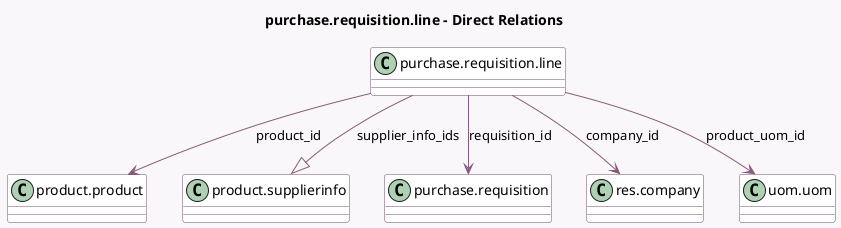

<!-- GENERATED:MODEL -->
---
tags: [odoo, community, generated, model]
---

# purchase.requisition.line

- Module: [[docs/Community Addons/purchase_requisition/purchase_requisition|purchase_requisition]]
- Scope: Community Addons
- Defined in module: yes
- Source files: `models/purchase_requisition.py`
- Python classes: `PurchaseRequisitionLine`
- Description: Purchase Requisition Line
- Inherits: `analytic.mixin`

## Field footprint

- Detected fields: 9
- Field types: `Char` x 1, `Float` x 3, `Many2one` x 4, `One2many` x 1
- Relation fields: 5

## Sample fields

- `company_id`: `Many2one` (comodel `res.company`, related `requisition_id.company_id`, store `True`)
- `price_unit`: `Float` (compute `_compute_price_unit`, store `True`)
- `product_description_variants`: `Char` (comodel `Description`)
- `product_id`: `Many2one` (comodel `product.product`)
- `product_qty`: `Float`
- `product_uom_id`: `Many2one` (comodel `uom.uom`, compute `_compute_product_uom_id`, store `True`)
- `qty_ordered`: `Float` (compute `_compute_ordered_qty`)
- `requisition_id`: `Many2one` (comodel `purchase.requisition`)
- `supplier_info_ids`: `One2many` (comodel `product.supplierinfo`)

## Method hints

- Detected methods: 8
- Action methods: none
- Compute methods: `_compute_ordered_qty`, `_compute_price_unit`, `_compute_product_uom_id`
- Onchange methods: none

## Direct relation diagram

## Navigation

- **Parent:** [[docs/Community Addons/purchase_requisition/Models]]

<!-- GENERATED:MODEL -->
