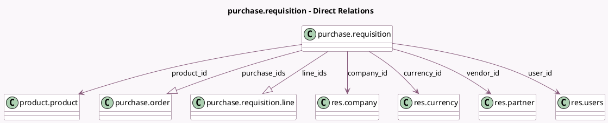

<!-- GENERATED:MODEL -->
---
tags: [odoo, community, generated, model]
---

# purchase.requisition

- Module: [[docs/Community Addons/purchase_requisition/purchase_requisition|purchase_requisition]]
- Scope: Community Addons
- Defined in module: yes
- Source files: `models/purchase_requisition.py`
- Python classes: `PurchaseRequisition`
- Description: Purchase Requisition
- Inherits: `mail.activity.mixin`, `mail.thread`

## Field footprint

- Detected fields: 16
- Field types: `Boolean` x 1, `Char` x 2, `Date` x 2, `Html` x 1, `Integer` x 1, `Many2one` x 5, `One2many` x 2, `Selection` x 2
- Relation fields: 7

## Sample fields

- `active`: `Boolean` (comodel `Active`)
- `company_id`: `Many2one` (comodel `res.company`)
- `currency_id`: `Many2one` (comodel `res.currency`, compute `_compute_currency_id`, store `True`)
- `date_end`: `Date`
- `date_start`: `Date`
- `description`: `Html`
- `line_ids`: `One2many` (comodel `purchase.requisition.line`)
- `name`: `Char`
- `order_count`: `Integer` (compute `_compute_orders_number`)
- `product_id`: `Many2one` (comodel `product.product`, related `line_ids.product_id`)
- `purchase_ids`: `One2many` (comodel `purchase.order`)
- `reference`: `Char`
- `requisition_type`: `Selection`
- `state`: `Selection`
- `user_id`: `Many2one` (comodel `res.users`)
- `vendor_id`: `Many2one` (comodel `res.partner`)

## Method hints

- Detected methods: 12
- Action methods: `action_cancel`, `action_confirm`, `action_done`, `action_draft`
- Compute methods: `_compute_currency_id`, `_compute_orders_number`
- Onchange methods: `_onchange_vendor`

## Direct relation diagram

## Navigation

- **Parent:** [[docs/Community Addons/purchase_requisition/Models]]

<!-- GENERATED:MODEL -->
