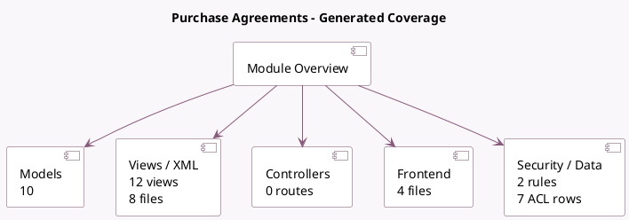

<!-- GENERATED:MODULE -->
---
tags: [odoo, community, module]
---

# Purchase Agreements

- Scope: Community Addons
- Source: odoo/addons/purchase_requisition
- Dependencies: [[docs/Community Addons/purchase/purchase|purchase]]

## Generated coverage

- Models: 10
- XML files with UI/data artifacts: 8
- Views: 12
- Actions: 4
- Menus: 1
- Rules (ir.rule): 2
- Access CSV entries: 7
- Controller units: 0
- Frontend asset files: 4

## Module map

## Detail notes

- Models: [[docs/Community Addons/purchase_requisition/Models|Models]] (10)
- Views and XML: [[docs/Community Addons/purchase_requisition/Views|Views]] (8 files)
- Frontend: [[docs/Community Addons/purchase_requisition/Frontend|Frontend]] (4 files)

## Key models

- `product.product`
- `product.supplierinfo`
- `purchase.order`
- `purchase.order.group`
- `purchase.order.line`
- `purchase.requisition`
- `purchase.requisition.alternative.warning`
- `purchase.requisition.create.alternative`
- `purchase.requisition.line`
- `res.config.settings`

## Navigation

- [[../Community Addons/Community Addons|Back to scope]]
- [[../../docs/docs|Back to docs]]

<!-- GENERATED:MODULE -->

