<!-- GENERATED:MODEL -->
---
tags: [odoo, community, generated, model]
---

# stock.move

- Module: [[docs/Community Addons/purchase_requisition_stock/purchase_requisition_stock|purchase_requisition_stock]]
- Scope: Community Addons
- Defined in module: extension only
- Source files: `models/stock.py`
- Python classes: `StockMove`

## Field footprint

- Detected fields: 1
- Field types: `One2many` x 1
- Relation fields: 1

## Sample fields

- `requisition_line_ids`: `One2many` (comodel `purchase.requisition.line`)

## Method hints

- Detected methods: 1
- Action methods: none
- Compute methods: none
- Onchange methods: none

## Direct relation diagram

```plantuml
@startuml
!define ODOO_COLOR_PRIMARY #714B67
!define ODOO_COLOR_ACCENT #875A7B
!define ODOO_COLOR_BG #FAF7FA

skinparam backgroundColor ODOO_COLOR_BG
skinparam defaultTextAlignment left
skinparam ArrowColor ODOO_COLOR_ACCENT
skinparam ClassBackgroundColor white
skinparam ClassBorderColor ODOO_COLOR_PRIMARY
skinparam ComponentBackgroundColor white
skinparam ComponentBorderColor ODOO_COLOR_PRIMARY
skinparam NoteBackgroundColor #FFF8FF
skinparam NoteBorderColor ODOO_COLOR_ACCENT
skinparam SequenceLifeLineBorderColor ODOO_COLOR_ACCENT
skinparam SequenceLifeLineBackgroundColor #FFFFFF
skinparam SequenceParticipantBorderColor ODOO_COLOR_PRIMARY
skinparam SequenceParticipantBackgroundColor #FFFFFF
skinparam sequence {
  ArrowColor ODOO_COLOR_ACCENT
  ActorBorderColor ODOO_COLOR_PRIMARY
}
title stock.move - Direct Relations
class "stock.move" as stock_move
class "purchase.requisition.line" as purchase_requisition_line
stock_move --|> purchase_requisition_line : requisition_line_ids
@enduml
```

## Navigation

- **Parent:** [[docs/Community Addons/purchase_requisition_stock/Models]]

<!-- GENERATED:MODEL -->
