<!-- GENERATED:MODEL -->
---
tags: [odoo, community, generated, model]
---

# product.product

- Module: [[docs/Community Addons/purchase_stock/purchase_stock|purchase_stock]]
- Scope: Community Addons
- Defined in module: extension only
- Source files: `models/product.py`
- Python classes: `ProductProduct`

## Field footprint

- Detected fields: 4
- Field types: `Float` x 2, `Integer` x 1, `One2many` x 1
- Relation fields: 1

## Sample fields

- `monthly_demand`: `Float` (compute `_compute_monthly_demand`)
- `purchase_order_line_ids`: `One2many` (comodel `purchase.order.line`)
- `suggest_estimated_price`: `Float` (compute `_compute_suggest_estimated_price`)
- `suggested_qty`: `Integer` (compute `_compute_suggested_quantity`)

## Method hints

- Detected methods: 9
- Action methods: none
- Compute methods: `_compute_monthly_demand`, `_compute_quantities`, `_compute_quantities_dict`, `_compute_suggest_estimated_price`, `_compute_suggested_quantity`
- Onchange methods: none

## Direct relation diagram

```plantuml
@startuml
!define ODOO_COLOR_PRIMARY #714B67
!define ODOO_COLOR_ACCENT #875A7B
!define ODOO_COLOR_BG #FAF7FA

skinparam backgroundColor ODOO_COLOR_BG
skinparam defaultTextAlignment left
skinparam ArrowColor ODOO_COLOR_ACCENT
skinparam ClassBackgroundColor white
skinparam ClassBorderColor ODOO_COLOR_PRIMARY
skinparam ComponentBackgroundColor white
skinparam ComponentBorderColor ODOO_COLOR_PRIMARY
skinparam NoteBackgroundColor #FFF8FF
skinparam NoteBorderColor ODOO_COLOR_ACCENT
skinparam SequenceLifeLineBorderColor ODOO_COLOR_ACCENT
skinparam SequenceLifeLineBackgroundColor #FFFFFF
skinparam SequenceParticipantBorderColor ODOO_COLOR_PRIMARY
skinparam SequenceParticipantBackgroundColor #FFFFFF
skinparam sequence {
  ArrowColor ODOO_COLOR_ACCENT
  ActorBorderColor ODOO_COLOR_PRIMARY
}
title product.product - Direct Relations
class "product.product" as product_product
class "purchase.order.line" as purchase_order_line
product_product --|> purchase_order_line : purchase_order_line_ids
@enduml
```

## Navigation

- **Parent:** [[docs/Community Addons/purchase_stock/Models]]

<!-- GENERATED:MODEL -->
