<!-- GENERATED:MODEL -->
---
tags: [odoo, community, generated, model]
---

# purchase.order.line

- Module: [[docs/Community Addons/purchase_stock/purchase_stock|purchase_stock]]
- Scope: Community Addons
- Defined in module: extension only
- Source files: `models/purchase_order_line.py`
- Python classes: `PurchaseOrderLine`

## Field footprint

- Detected fields: 9
- Field types: `Boolean` x 3, `Char` x 1, `Many2many` x 1, `Many2one` x 2, `One2many` x 1, `Selection` x 1
- Relation fields: 4

## Sample fields

- `forecasted_issue`: `Boolean` (compute `_compute_forecasted_issue`)
- `is_storable`: `Boolean` (related `product_id.is_storable`)
- `location_final_id`: `Many2one` (comodel `stock.location`)
- `move_dest_ids`: `Many2many` (comodel `stock.move`)
- `move_ids`: `One2many` (comodel `stock.move`)
- `orderpoint_id`: `Many2one` (comodel `stock.warehouse.orderpoint`)
- `product_description_variants`: `Char` (comodel `Custom Description`)
- `propagate_cancel`: `Boolean` (comodel `Propagate cancellation`)
- `qty_received_method`: `Selection`

## Method hints

- Detected methods: 25
- Action methods: `action_product_forecast_report`
- Compute methods: `_compute_forecasted_issue`, `_compute_qty_received`, `_compute_qty_received_method`
- Onchange methods: none

## Direct relation diagram

```plantuml
@startuml
!define ODOO_COLOR_PRIMARY #714B67
!define ODOO_COLOR_ACCENT #875A7B
!define ODOO_COLOR_BG #FAF7FA

skinparam backgroundColor ODOO_COLOR_BG
skinparam defaultTextAlignment left
skinparam ArrowColor ODOO_COLOR_ACCENT
skinparam ClassBackgroundColor white
skinparam ClassBorderColor ODOO_COLOR_PRIMARY
skinparam ComponentBackgroundColor white
skinparam ComponentBorderColor ODOO_COLOR_PRIMARY
skinparam NoteBackgroundColor #FFF8FF
skinparam NoteBorderColor ODOO_COLOR_ACCENT
skinparam SequenceLifeLineBorderColor ODOO_COLOR_ACCENT
skinparam SequenceLifeLineBackgroundColor #FFFFFF
skinparam SequenceParticipantBorderColor ODOO_COLOR_PRIMARY
skinparam SequenceParticipantBackgroundColor #FFFFFF
skinparam sequence {
  ArrowColor ODOO_COLOR_ACCENT
  ActorBorderColor ODOO_COLOR_PRIMARY
}
title purchase.order.line - Direct Relations
class "purchase.order.line" as purchase_order_line
class "stock.location" as stock_location
class "stock.move" as stock_move
class "stock.warehouse.orderpoint" as stock_warehouse_orderpoint
purchase_order_line --|> stock_move : move_ids
purchase_order_line --> stock_warehouse_orderpoint : orderpoint_id
purchase_order_line .. stock_move : move_dest_ids
purchase_order_line --> stock_location : location_final_id
@enduml
```

## Navigation

- **Parent:** [[docs/Community Addons/purchase_stock/Models]]

<!-- GENERATED:MODEL -->
