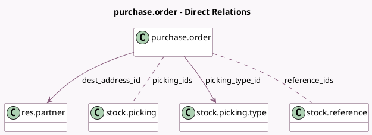

<!-- GENERATED:MODEL -->
---
tags: [odoo, community, generated, model]
---

# purchase.order

- Module: [[docs/Community Addons/purchase_stock/purchase_stock|purchase_stock]]
- Scope: Community Addons
- Defined in module: extension only
- Source files: `models/purchase_order.py`
- Python classes: `PurchaseOrder`

## Field footprint

- Detected fields: 11
- Field types: `Boolean` x 1, `Char` x 1, `Datetime` x 1, `Float` x 1, `Integer` x 1, `Many2many` x 2, `Many2one` x 2, `Selection` x 2
- Relation fields: 4

## Sample fields

- `default_location_dest_id_usage`: `Selection` (related `picking_type_id.default_location_dest_id.usage`)
- `dest_address_id`: `Many2one` (comodel `res.partner`, compute `_compute_dest_address_id`, store `True`)
- `effective_date`: `Datetime` (comodel `Arrival`, compute `_compute_effective_date`, store `True`)
- `incoming_picking_count`: `Integer` (comodel `Incoming Shipment count`, compute `_compute_incoming_picking_count`)
- `incoterm_location`: `Char`
- `is_shipped`: `Boolean` (compute `_compute_is_shipped`)
- `on_time_rate`: `Float` (related `partner_id.on_time_rate`)
- `picking_ids`: `Many2many` (comodel `stock.picking`, compute `_compute_picking_ids`, store `True`)
- `picking_type_id`: `Many2one` (comodel `stock.picking.type`)
- `receipt_status`: `Selection` (compute `_compute_receipt_status`, store `True`)
- `reference_ids`: `Many2many` (comodel `stock.reference`)

## Method hints

- Detected methods: 33
- Action methods: `action_add_from_catalog`, `action_purchase_order_suggest`, `action_view_picking`
- Compute methods: `_compute_dest_address_id`, `_compute_effective_date`, `_compute_incoming_picking_count`, `_compute_is_shipped`, `_compute_picking_ids`, `_compute_receipt_status`
- Onchange methods: `_onchange_company_id`

## Direct relation diagram

## Navigation

- **Parent:** [[docs/Community Addons/purchase_stock/Models]]

<!-- GENERATED:MODEL -->
