<!-- GENERATED:MODEL -->
---
tags: [odoo, community, generated, model]
---

# purchase.report

- Module: [[docs/Community Addons/purchase_stock/purchase_stock|purchase_stock]]
- Scope: Community Addons
- Defined in module: extension only
- Source files: `report/purchase_report.py`
- Python classes: `PurchaseReport`

## Field footprint

- Detected fields: 3
- Field types: `Datetime` x 1, `Float` x 1, `Many2one` x 1
- Relation fields: 1

## Sample fields

- `days_to_arrival`: `Float` (comodel `Effective Days To Arrival`)
- `effective_date`: `Datetime`
- `picking_type_id`: `Many2one` (comodel `stock.warehouse`)

## Method hints

- Detected methods: 3
- Action methods: none
- Compute methods: none
- Onchange methods: none

## Direct relation diagram

```plantuml
@startuml
!define ODOO_COLOR_PRIMARY #714B67
!define ODOO_COLOR_ACCENT #875A7B
!define ODOO_COLOR_BG #FAF7FA

skinparam backgroundColor ODOO_COLOR_BG
skinparam defaultTextAlignment left
skinparam ArrowColor ODOO_COLOR_ACCENT
skinparam ClassBackgroundColor white
skinparam ClassBorderColor ODOO_COLOR_PRIMARY
skinparam ComponentBackgroundColor white
skinparam ComponentBorderColor ODOO_COLOR_PRIMARY
skinparam NoteBackgroundColor #FFF8FF
skinparam NoteBorderColor ODOO_COLOR_ACCENT
skinparam SequenceLifeLineBorderColor ODOO_COLOR_ACCENT
skinparam SequenceLifeLineBackgroundColor #FFFFFF
skinparam SequenceParticipantBorderColor ODOO_COLOR_PRIMARY
skinparam SequenceParticipantBackgroundColor #FFFFFF
skinparam sequence {
  ArrowColor ODOO_COLOR_ACCENT
  ActorBorderColor ODOO_COLOR_PRIMARY
}
title purchase.report - Direct Relations
class "purchase.report" as purchase_report
class "stock.warehouse" as stock_warehouse
purchase_report --> stock_warehouse : picking_type_id
@enduml
```

## Navigation

- **Parent:** [[docs/Community Addons/purchase_stock/Models]]

<!-- GENERATED:MODEL -->
