<!-- GENERATED:MODEL -->
---
tags: [odoo, community, generated, model]
---

# res.partner

- Module: [[docs/Community Addons/purchase_stock/purchase_stock|purchase_stock]]
- Scope: Community Addons
- Defined in module: extension only
- Source files: `models/res_partner.py`
- Python classes: `ResPartner`

## Field footprint

- Detected fields: 7
- Field types: `Char` x 1, `Float` x 1, `Integer` x 2, `One2many` x 1, `Selection` x 2
- Relation fields: 1

## Sample fields

- `group_on`: `Selection`
- `group_rfq`: `Selection`
- `on_time_rate`: `Float` (comodel `On-Time Delivery Rate`, compute `_compute_on_time_rate`)
- `purchase_line_ids`: `One2many` (comodel `purchase.order.line`)
- `suggest_based_on`: `Char` (store `True`)
- `suggest_days`: `Integer` (store `True`)
- `suggest_percent`: `Integer` (store `True`)

## Method hints

- Detected methods: 1
- Action methods: none
- Compute methods: `_compute_on_time_rate`
- Onchange methods: none

## Direct relation diagram

```plantuml
@startuml
!define ODOO_COLOR_PRIMARY #714B67
!define ODOO_COLOR_ACCENT #875A7B
!define ODOO_COLOR_BG #FAF7FA

skinparam backgroundColor ODOO_COLOR_BG
skinparam defaultTextAlignment left
skinparam ArrowColor ODOO_COLOR_ACCENT
skinparam ClassBackgroundColor white
skinparam ClassBorderColor ODOO_COLOR_PRIMARY
skinparam ComponentBackgroundColor white
skinparam ComponentBorderColor ODOO_COLOR_PRIMARY
skinparam NoteBackgroundColor #FFF8FF
skinparam NoteBorderColor ODOO_COLOR_ACCENT
skinparam SequenceLifeLineBorderColor ODOO_COLOR_ACCENT
skinparam SequenceLifeLineBackgroundColor #FFFFFF
skinparam SequenceParticipantBorderColor ODOO_COLOR_PRIMARY
skinparam SequenceParticipantBackgroundColor #FFFFFF
skinparam sequence {
  ArrowColor ODOO_COLOR_ACCENT
  ActorBorderColor ODOO_COLOR_PRIMARY
}
title res.partner - Direct Relations
class "res.partner" as res_partner
class "purchase.order.line" as purchase_order_line
res_partner --|> purchase_order_line : purchase_line_ids
@enduml
```

## Navigation

- **Parent:** [[docs/Community Addons/purchase_stock/Models]]

<!-- GENERATED:MODEL -->
