<!-- GENERATED:MODEL -->
---
tags: [odoo, community, generated, model]
---

# stock.move

- Module: [[docs/Community Addons/purchase_stock/purchase_stock|purchase_stock]]
- Scope: Community Addons
- Defined in module: extension only
- Source files: `models/stock_move.py`
- Python classes: `StockMove`

## Field footprint

- Detected fields: 2
- Field types: `Many2many` x 1, `Many2one` x 1
- Relation fields: 2

## Sample fields

- `created_purchase_line_ids`: `Many2many` (comodel `purchase.order.line`)
- `purchase_line_id`: `Many2one` (comodel `purchase.order.line`)

## Method hints

- Detected methods: 19
- Action methods: none
- Compute methods: `_compute_description_picking`, `_compute_packaging_uom_id`, `_compute_partner_id`
- Onchange methods: none

## Direct relation diagram

```plantuml
@startuml
!define ODOO_COLOR_PRIMARY #714B67
!define ODOO_COLOR_ACCENT #875A7B
!define ODOO_COLOR_BG #FAF7FA

skinparam backgroundColor ODOO_COLOR_BG
skinparam defaultTextAlignment left
skinparam ArrowColor ODOO_COLOR_ACCENT
skinparam ClassBackgroundColor white
skinparam ClassBorderColor ODOO_COLOR_PRIMARY
skinparam ComponentBackgroundColor white
skinparam ComponentBorderColor ODOO_COLOR_PRIMARY
skinparam NoteBackgroundColor #FFF8FF
skinparam NoteBorderColor ODOO_COLOR_ACCENT
skinparam SequenceLifeLineBorderColor ODOO_COLOR_ACCENT
skinparam SequenceLifeLineBackgroundColor #FFFFFF
skinparam SequenceParticipantBorderColor ODOO_COLOR_PRIMARY
skinparam SequenceParticipantBackgroundColor #FFFFFF
skinparam sequence {
  ArrowColor ODOO_COLOR_ACCENT
  ActorBorderColor ODOO_COLOR_PRIMARY
}
title stock.move - Direct Relations
class "stock.move" as stock_move
class "purchase.order.line" as purchase_order_line
stock_move --> purchase_order_line : purchase_line_id
stock_move .. purchase_order_line : created_purchase_line_ids
@enduml
```

## Navigation

- **Parent:** [[docs/Community Addons/purchase_stock/Models]]

<!-- GENERATED:MODEL -->
