<!-- GENERATED:MODEL -->
---
tags: [odoo, community, generated, model]
---

# stock.picking

- Module: [[docs/Community Addons/purchase_stock/purchase_stock|purchase_stock]]
- Scope: Community Addons
- Defined in module: extension only
- Source files: `models/stock.py`
- Python classes: `StockPicking`

## Field footprint

- Detected fields: 3
- Field types: `Datetime` x 2, `Many2one` x 1
- Relation fields: 1

## Sample fields

- `days_to_arrive`: `Datetime` (compute `_compute_effective_date`)
- `delay_pass`: `Datetime` (compute `_compute_date_order`)
- `purchase_id`: `Many2one` (comodel `purchase.order`, related `move_ids.purchase_line_id.order_id`)

## Method hints

- Detected methods: 4
- Action methods: none
- Compute methods: `_compute_date_order`, `_compute_effective_date`
- Onchange methods: none

## Direct relation diagram

```plantuml
@startuml
!define ODOO_COLOR_PRIMARY #714B67
!define ODOO_COLOR_ACCENT #875A7B
!define ODOO_COLOR_BG #FAF7FA

skinparam backgroundColor ODOO_COLOR_BG
skinparam defaultTextAlignment left
skinparam ArrowColor ODOO_COLOR_ACCENT
skinparam ClassBackgroundColor white
skinparam ClassBorderColor ODOO_COLOR_PRIMARY
skinparam ComponentBackgroundColor white
skinparam ComponentBorderColor ODOO_COLOR_PRIMARY
skinparam NoteBackgroundColor #FFF8FF
skinparam NoteBorderColor ODOO_COLOR_ACCENT
skinparam SequenceLifeLineBorderColor ODOO_COLOR_ACCENT
skinparam SequenceLifeLineBackgroundColor #FFFFFF
skinparam SequenceParticipantBorderColor ODOO_COLOR_PRIMARY
skinparam SequenceParticipantBackgroundColor #FFFFFF
skinparam sequence {
  ArrowColor ODOO_COLOR_ACCENT
  ActorBorderColor ODOO_COLOR_PRIMARY
}
title stock.picking - Direct Relations
class "stock.picking" as stock_picking
class "purchase.order" as purchase_order
stock_picking --> purchase_order : purchase_id
@enduml
```

## Navigation

- **Parent:** [[docs/Community Addons/purchase_stock/Models]]

<!-- GENERATED:MODEL -->
