<!-- GENERATED:MODEL -->
---
tags: [odoo, community, generated, model]
---

# stock.warehouse.orderpoint

- Module: [[docs/Community Addons/purchase_stock/purchase_stock|purchase_stock]]
- Scope: Community Addons
- Defined in module: extension only
- Source files: `models/stock.py`
- Python classes: `StockWarehouseOrderpoint`

## Field footprint

- Detected fields: 6
- Field types: `Boolean` x 1, `Char` x 1, `Many2one` x 3, `One2many` x 1
- Relation fields: 4

## Sample fields

- `available_vendor`: `Many2one` (comodel `res.partner`, store `False`)
- `effective_vendor_id`: `Many2one` (comodel `res.partner`, compute `_compute_effective_vendor_id`, store `False`)
- `show_supplier`: `Boolean` (comodel `Show supplier column`, compute `_compute_show_supplier`)
- `supplier_id`: `Many2one` (comodel `product.supplierinfo`)
- `supplier_id_placeholder`: `Char` (compute `_compute_supplier_id_placeholder`)
- `vendor_ids`: `One2many` (related `product_id.seller_ids`)

## Method hints

- Detected methods: 21
- Action methods: `action_view_purchase`
- Compute methods: `_compute_days_to_order`, `_compute_deadline_date`, `_compute_effective_vendor_id`, `_compute_lead_days`, `_compute_qty_to_order_computed`, `_compute_show_supplier`, `_compute_show_supply_warning`, `_compute_supplier_id_placeholder`
- Onchange methods: none

## Direct relation diagram

```plantuml
@startuml
!define ODOO_COLOR_PRIMARY #714B67
!define ODOO_COLOR_ACCENT #875A7B
!define ODOO_COLOR_BG #FAF7FA

skinparam backgroundColor ODOO_COLOR_BG
skinparam defaultTextAlignment left
skinparam ArrowColor ODOO_COLOR_ACCENT
skinparam ClassBackgroundColor white
skinparam ClassBorderColor ODOO_COLOR_PRIMARY
skinparam ComponentBackgroundColor white
skinparam ComponentBorderColor ODOO_COLOR_PRIMARY
skinparam NoteBackgroundColor #FFF8FF
skinparam NoteBorderColor ODOO_COLOR_ACCENT
skinparam SequenceLifeLineBorderColor ODOO_COLOR_ACCENT
skinparam SequenceLifeLineBackgroundColor #FFFFFF
skinparam SequenceParticipantBorderColor ODOO_COLOR_PRIMARY
skinparam SequenceParticipantBackgroundColor #FFFFFF
skinparam sequence {
  ArrowColor ODOO_COLOR_ACCENT
  ActorBorderColor ODOO_COLOR_PRIMARY
}
title stock.warehouse.orderpoint - Direct Relations
class "stock.warehouse.orderpoint" as stock_warehouse_orderpoint
class "product.supplierinfo" as product_supplierinfo
class "res.partner" as res_partner
stock_warehouse_orderpoint --> product_supplierinfo : supplier_id
stock_warehouse_orderpoint --> res_partner : effective_vendor_id
stock_warehouse_orderpoint --> res_partner : available_vendor
@enduml
```

## Navigation

- **Parent:** [[docs/Community Addons/purchase_stock/Models]]

<!-- GENERATED:MODEL -->
