<!-- GENERATED:MODEL -->
---
tags: [odoo, community, generated, model]
---

# vendor.delay.report

- Module: [[docs/Community Addons/purchase_stock/purchase_stock|purchase_stock]]
- Scope: Community Addons
- Defined in module: yes
- Source files: `report/vendor_delay_report.py`
- Python classes: `VendorDelayReport`
- Description: Vendor Delay Report

## Field footprint

- Detected fields: 7
- Field types: `Datetime` x 1, `Float` x 3, `Many2one` x 3
- Relation fields: 3

## Sample fields

- `category_id`: `Many2one` (comodel `product.category`)
- `date`: `Datetime` (comodel `Effective Date`)
- `on_time_rate`: `Float` (comodel `On-Time Delivery Rate`)
- `partner_id`: `Many2one` (comodel `res.partner`)
- `product_id`: `Many2one` (comodel `product.product`)
- `qty_on_time`: `Float` (comodel `On-Time Quantity`)
- `qty_total`: `Float` (comodel `Total Quantity`)

## Method hints

- Detected methods: 3
- Action methods: none
- Compute methods: none
- Onchange methods: none

## Direct relation diagram

```plantuml
@startuml
!define ODOO_COLOR_PRIMARY #714B67
!define ODOO_COLOR_ACCENT #875A7B
!define ODOO_COLOR_BG #FAF7FA

skinparam backgroundColor ODOO_COLOR_BG
skinparam defaultTextAlignment left
skinparam ArrowColor ODOO_COLOR_ACCENT
skinparam ClassBackgroundColor white
skinparam ClassBorderColor ODOO_COLOR_PRIMARY
skinparam ComponentBackgroundColor white
skinparam ComponentBorderColor ODOO_COLOR_PRIMARY
skinparam NoteBackgroundColor #FFF8FF
skinparam NoteBorderColor ODOO_COLOR_ACCENT
skinparam SequenceLifeLineBorderColor ODOO_COLOR_ACCENT
skinparam SequenceLifeLineBackgroundColor #FFFFFF
skinparam SequenceParticipantBorderColor ODOO_COLOR_PRIMARY
skinparam SequenceParticipantBackgroundColor #FFFFFF
skinparam sequence {
  ArrowColor ODOO_COLOR_ACCENT
  ActorBorderColor ODOO_COLOR_PRIMARY
}
title vendor.delay.report - Direct Relations
class "vendor.delay.report" as vendor_delay_report
class "product.category" as product_category
class "product.product" as product_product
class "res.partner" as res_partner
vendor_delay_report --> res_partner : partner_id
vendor_delay_report --> product_product : product_id
vendor_delay_report --> product_category : category_id
@enduml
```

## Navigation

- **Parent:** [[docs/Community Addons/purchase_stock/Models]]

<!-- GENERATED:MODEL -->
