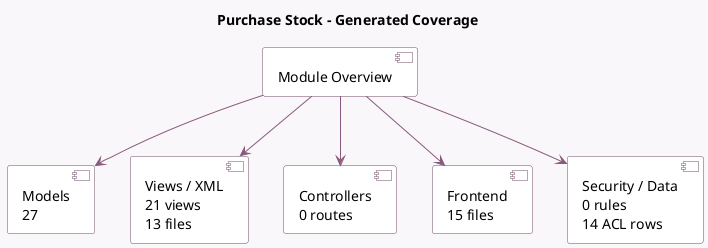

<!-- GENERATED:MODULE -->
---
tags: [odoo, community, module]
---

# Purchase Stock

- Scope: Community Addons
- Source: odoo/addons/purchase_stock
- Dependencies: [[docs/Community Addons/stock_account/stock_account|stock_account]], [[docs/Community Addons/purchase/purchase|purchase]]

## Summary

Purchase Orders, Receipts, Vendor Bills for Stock

## Generated coverage

- Models: 27
- XML files with UI/data artifacts: 13
- Views: 21
- Actions: 1
- Menus: 0
- Rules (ir.rule): 0
- Access CSV entries: 14
- Controller units: 0
- Frontend asset files: 15

## Module map

## Detail notes

- Models: [[docs/Community Addons/purchase_stock/Models|Models]] (27)
- Views and XML: [[docs/Community Addons/purchase_stock/Views|Views]] (13 files)
- Frontend: [[docs/Community Addons/purchase_stock/Frontend|Frontend]] (15 files)

## Key models

- `account.move`
- `account.move.line`
- `product.product`
- `product.replenish`
- `product.supplierinfo`
- `product.template`
- `purchase.order`
- `purchase.order.line`
- `purchase.report`
- `report.stock.report_stock_rule`
- `res.company`
- `res.config.settings`

## Navigation

- [[../Community Addons/Community Addons|Back to scope]]
- [[../../docs/docs|Back to docs]]

<!-- GENERATED:MODULE -->

