<!-- GENERATED:MODEL -->
---
tags: [odoo, community, generated, model]
---

# mail.message

- Module: [[docs/Community Addons/rating/rating|rating]]
- Scope: Community Addons
- Defined in module: extension only
- Source files: `models/mail_message.py`
- Python classes: `MailMessage`

## Field footprint

- Detected fields: 3
- Field types: `Float` x 1, `Many2one` x 1, `One2many` x 1
- Relation fields: 2

## Sample fields

- `rating_id`: `Many2one` (comodel `rating.rating`, compute `_compute_rating_id`)
- `rating_ids`: `One2many` (comodel `rating.rating`)
- `rating_value`: `Float` (comodel `Rating Value`, compute `_compute_rating_value`, store `False`)

## Method hints

- Detected methods: 6
- Action methods: none
- Compute methods: `_compute_rating_id`, `_compute_rating_value`
- Onchange methods: none

## Direct relation diagram

```plantuml
@startuml
!define ODOO_COLOR_PRIMARY #714B67
!define ODOO_COLOR_ACCENT #875A7B
!define ODOO_COLOR_BG #FAF7FA

skinparam backgroundColor ODOO_COLOR_BG
skinparam defaultTextAlignment left
skinparam ArrowColor ODOO_COLOR_ACCENT
skinparam ClassBackgroundColor white
skinparam ClassBorderColor ODOO_COLOR_PRIMARY
skinparam ComponentBackgroundColor white
skinparam ComponentBorderColor ODOO_COLOR_PRIMARY
skinparam NoteBackgroundColor #FFF8FF
skinparam NoteBorderColor ODOO_COLOR_ACCENT
skinparam SequenceLifeLineBorderColor ODOO_COLOR_ACCENT
skinparam SequenceLifeLineBackgroundColor #FFFFFF
skinparam SequenceParticipantBorderColor ODOO_COLOR_PRIMARY
skinparam SequenceParticipantBackgroundColor #FFFFFF
skinparam sequence {
  ArrowColor ODOO_COLOR_ACCENT
  ActorBorderColor ODOO_COLOR_PRIMARY
}
title mail.message - Direct Relations
class "mail.message" as mail_message
class "rating.rating" as rating_rating
mail_message --|> rating_rating : rating_ids
mail_message --> rating_rating : rating_id
@enduml
```

## Navigation

- **Parent:** [[docs/Community Addons/rating/Models]]

<!-- GENERATED:MODEL -->
