<!-- GENERATED:MODEL -->
---
tags: [odoo, community, generated, model]
---

# rating.parent.mixin

- Module: [[docs/Community Addons/rating/rating|rating]]
- Scope: Community Addons
- Defined in module: yes
- Source files: `models/rating_parent_mixin.py`
- Python classes: `RatingParentMixin`
- Description: Rating Parent Mixin

## Field footprint

- Detected fields: 5
- Field types: `Float` x 2, `Integer` x 2, `One2many` x 1
- Relation fields: 1

## Sample fields

- `rating_avg`: `Float` (comodel `Average Rating`, compute `_compute_rating_percentage_satisfaction`)
- `rating_avg_percentage`: `Float` (comodel `Average Rating (%)`, compute `_compute_rating_percentage_satisfaction`)
- `rating_count`: `Integer` (compute `_compute_rating_percentage_satisfaction`)
- `rating_ids`: `One2many` (comodel `rating.rating`)
- `rating_percentage_satisfaction`: `Integer` (comodel `Rating Satisfaction`, compute `_compute_rating_percentage_satisfaction`, store `False`)

## Method hints

- Detected methods: 2
- Action methods: none
- Compute methods: `_compute_rating_percentage_satisfaction`
- Onchange methods: none

## Direct relation diagram

```plantuml
@startuml
!define ODOO_COLOR_PRIMARY #714B67
!define ODOO_COLOR_ACCENT #875A7B
!define ODOO_COLOR_BG #FAF7FA

skinparam backgroundColor ODOO_COLOR_BG
skinparam defaultTextAlignment left
skinparam ArrowColor ODOO_COLOR_ACCENT
skinparam ClassBackgroundColor white
skinparam ClassBorderColor ODOO_COLOR_PRIMARY
skinparam ComponentBackgroundColor white
skinparam ComponentBorderColor ODOO_COLOR_PRIMARY
skinparam NoteBackgroundColor #FFF8FF
skinparam NoteBorderColor ODOO_COLOR_ACCENT
skinparam SequenceLifeLineBorderColor ODOO_COLOR_ACCENT
skinparam SequenceLifeLineBackgroundColor #FFFFFF
skinparam SequenceParticipantBorderColor ODOO_COLOR_PRIMARY
skinparam SequenceParticipantBackgroundColor #FFFFFF
skinparam sequence {
  ArrowColor ODOO_COLOR_ACCENT
  ActorBorderColor ODOO_COLOR_PRIMARY
}
title rating.parent.mixin - Direct Relations
class "rating.parent.mixin" as rating_parent_mixin
class "rating.rating" as rating_rating
rating_parent_mixin --|> rating_rating : rating_ids
@enduml
```

## Navigation

- **Parent:** [[docs/Community Addons/rating/Models]]

<!-- GENERATED:MODEL -->
