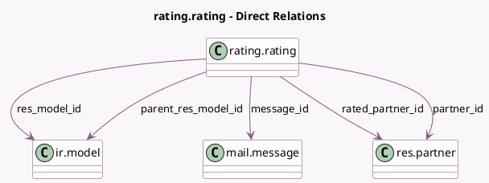

<!-- GENERATED:MODEL -->
---
tags: [odoo, community, generated, model]
---

# rating.rating

- Module: [[docs/Community Addons/rating/rating|rating]]
- Scope: Community Addons
- Defined in module: yes
- Source files: `models/rating.py`
- Python classes: `RatingRating`
- Description: Rating

## Field footprint

- Detected fields: 24
- Field types: `Binary` x 1, `Boolean` x 2, `Char` x 7, `Datetime` x 2, `Float` x 1, `Integer` x 1, `Many2one` x 5, `Many2oneReference` x 1, `Reference` x 2, `Selection` x 1, `Text` x 1
- Relation fields: 5

## Sample fields

- `access_token`: `Char` (comodel `Security Token`)
- `consumed`: `Boolean`
- `create_date`: `Datetime`
- `feedback`: `Text` (comodel `Comment`)
- `is_internal`: `Boolean` (comodel `Visible Internally Only`, related `message_id.is_internal`, store `True`)
- `message_id`: `Many2one` (comodel `mail.message`)
- `parent_ref`: `Reference` (compute `_compute_parent_ref`)
- `parent_res_id`: `Integer` (comodel `Parent Document`)
- `parent_res_model`: `Char` (comodel `Parent Document Model`, related `parent_res_model_id.model`, store `True`)
- `parent_res_model_id`: `Many2one` (comodel `ir.model`)
- `parent_res_name`: `Char` (comodel `Parent Document Name`, compute `_compute_parent_res_name`, store `True`)
- `partner_id`: `Many2one` (comodel `res.partner`)
- `rated_on`: `Datetime`
- `rated_partner_id`: `Many2one` (comodel `res.partner`)
- `rated_partner_name`: `Char` (related `rated_partner_id.name`)
- `rating`: `Float`
- `rating_image`: `Binary` (comodel `Image`, compute `_compute_rating_image`)
- `rating_image_url`: `Char` (comodel `Image URL`, compute `_compute_rating_image`)
- `rating_text`: `Selection` (compute `_compute_rating_text`, store `True`)
- `res_id`: `Many2oneReference`

## Method hints

- Detected methods: 17
- Action methods: `action_open_rated_object`
- Compute methods: `_compute_parent_ref`, `_compute_parent_res_name`, `_compute_rating_image`, `_compute_rating_text`, `_compute_res_name`, `_compute_resource_ref`
- Onchange methods: none

## Direct relation diagram

## Navigation

- **Parent:** [[docs/Community Addons/rating/Models]]

<!-- GENERATED:MODEL -->
