<!-- GENERATED:MODEL -->
---
tags: [odoo, community, generated, model]
---

# repair.order

- Module: [[docs/Community Addons/repair/repair|repair]]
- Scope: Community Addons
- Defined in module: yes
- Source files: `models/repair.py`
- Python classes: `RepairOrder`
- Description: Repair Order
- Inherits: `mail.activity.mixin`, `mail.thread`, `product.catalog.mixin`

## Field footprint

- Detected fields: 43
- Field types: `Boolean` x 7, `Char` x 2, `Datetime` x 1, `Float` x 1, `Html` x 1, `Many2many` x 3, `Many2one` x 18, `One2many` x 3, `Properties` x 1, `Selection` x 5, `Text` x 1
- Relation fields: 24

## Sample fields

- `allowed_lot_ids`: `One2many` (comodel `stock.lot`, compute `_compute_allowed_lot_ids`)
- `allowed_uom_ids`: `Many2many` (comodel `uom.uom`, compute `_compute_allowed_uom_ids`)
- `company_id`: `Many2one` (comodel `res.company`)
- `has_uncomplete_moves`: `Boolean` (compute `_compute_has_uncomplete_moves`)
- `internal_notes`: `Html` (comodel `Internal Notes`)
- `is_parts_available`: `Boolean` (comodel `All Parts are available`, compute `_compute_availability_boolean`, store `True`)
- `is_parts_late`: `Boolean` (comodel `Any Part is late`, compute `_compute_availability_boolean`, store `True`)
- `location_dest_id`: `Many2one` (comodel `stock.location`, related `picking_type_id.default_location_dest_id`, store `True`)
- `location_id`: `Many2one` (comodel `stock.location`, compute `_compute_location_id`, store `True`)
- `lot_id`: `Many2one` (comodel `stock.lot`, compute `compute_lot_id`, store `True`)
- `move_id`: `Many2one` (comodel `stock.move`)
- `move_ids`: `One2many` (comodel `stock.move`)
- `name`: `Char` (comodel `Repair Reference`)
- `partner_id`: `Many2one` (comodel `res.partner`, compute `_compute_partner_id`, store `True`)
- `parts_availability`: `Char` (compute `_compute_parts_availability`)
- `parts_availability_state`: `Selection` (compute `_compute_parts_availability`)
- `parts_location_id`: `Many2one` (comodel `stock.location`, related `picking_type_id.default_remove_location_dest_id`, store `True`)
- `picking_id`: `Many2one` (comodel `stock.picking`)
- `picking_product_id`: `Many2one` (related `picking_id.product_id`)
- `picking_product_ids`: `One2many` (comodel `product.product`, compute `_compute_picking_product_ids`)

## Method hints

- Detected methods: 50
- Action methods: `action_add_from_catalog`, `action_assign`, `action_create_sale_order`, `action_generate_serial`, `action_repair_cancel`, `action_repair_cancel_draft`, `action_repair_done`, `action_repair_end`, and 4 more
- Compute methods: `_compute_allowed_lot_ids`, `_compute_allowed_uom_ids`, `_compute_availability_boolean`, `_compute_has_uncomplete_moves`, `_compute_location_id`, `_compute_partner_id`, `_compute_parts_availability`, `_compute_picking_product_ids`, and 7 more
- Onchange methods: `_onchange_location_picking`, `onchange_product_uom`

## Direct relation diagram

```plantuml
@startuml
!define ODOO_COLOR_PRIMARY #714B67
!define ODOO_COLOR_ACCENT #875A7B
!define ODOO_COLOR_BG #FAF7FA

skinparam backgroundColor ODOO_COLOR_BG
skinparam defaultTextAlignment left
skinparam ArrowColor ODOO_COLOR_ACCENT
skinparam ClassBackgroundColor white
skinparam ClassBorderColor ODOO_COLOR_PRIMARY
skinparam ComponentBackgroundColor white
skinparam ComponentBorderColor ODOO_COLOR_PRIMARY
skinparam NoteBackgroundColor #FFF8FF
skinparam NoteBorderColor ODOO_COLOR_ACCENT
skinparam SequenceLifeLineBorderColor ODOO_COLOR_ACCENT
skinparam SequenceLifeLineBackgroundColor #FFFFFF
skinparam SequenceParticipantBorderColor ODOO_COLOR_PRIMARY
skinparam SequenceParticipantBackgroundColor #FFFFFF
skinparam sequence {
  ArrowColor ODOO_COLOR_ACCENT
  ActorBorderColor ODOO_COLOR_PRIMARY
}
title repair.order - Direct Relations
class "repair.order" as repair_order
class "product.product" as product_product
class "repair.tags" as repair_tags
class "res.company" as res_company
class "res.partner" as res_partner
class "res.users" as res_users
class "sale.order" as sale_order
class "sale.order.line" as sale_order_line
class "stock.location" as stock_location
class "stock.lot" as stock_lot
class "stock.move" as stock_move
class "stock.picking" as stock_picking
class "stock.picking.type" as stock_picking_type
repair_order --> res_company : company_id
repair_order --> res_partner : partner_id
repair_order --> res_users : user_id
repair_order .. repair_tags : tag_ids
repair_order --> stock_move : move_id
repair_order --> product_product : product_id
repair_order .. uom_uom : allowed_uom_ids
repair_order --> uom_uom : product_uom
repair_order --> stock_lot : lot_id
repair_order --> stock_picking_type : picking_type_id
repair_order .. stock_reference : reference_ids
repair_order --> stock_location : location_id
repair_order --> stock_location : product_location_src_id
repair_order --> stock_location : product_location_dest_id
repair_order --> stock_location : location_dest_id
repair_order --> stock_location : parts_location_id
repair_order --> stock_location : recycle_location_id
repair_order --|> stock_move : move_ids
@enduml
```

## Navigation

- **Parent:** [[docs/Community Addons/repair/Models]]

<!-- GENERATED:MODEL -->
