<!-- GENERATED:MODEL -->
---
tags: [odoo, community, generated, model]
---

# sale.order

- Module: [[docs/Community Addons/repair/repair|repair]]
- Scope: Community Addons
- Defined in module: extension only
- Source files: `models/sale_order.py`
- Python classes: `SaleOrder`

## Field footprint

- Detected fields: 2
- Field types: `Integer` x 1, `One2many` x 1
- Relation fields: 1

## Sample fields

- `repair_count`: `Integer` (comodel `Repair Order(s)`, compute `_compute_repair_count`)
- `repair_order_ids`: `One2many` (comodel `repair.order`)

## Method hints

- Detected methods: 4
- Action methods: `action_show_repair`
- Compute methods: `_compute_repair_count`
- Onchange methods: none

## Direct relation diagram

```plantuml
@startuml
!define ODOO_COLOR_PRIMARY #714B67
!define ODOO_COLOR_ACCENT #875A7B
!define ODOO_COLOR_BG #FAF7FA

skinparam backgroundColor ODOO_COLOR_BG
skinparam defaultTextAlignment left
skinparam ArrowColor ODOO_COLOR_ACCENT
skinparam ClassBackgroundColor white
skinparam ClassBorderColor ODOO_COLOR_PRIMARY
skinparam ComponentBackgroundColor white
skinparam ComponentBorderColor ODOO_COLOR_PRIMARY
skinparam NoteBackgroundColor #FFF8FF
skinparam NoteBorderColor ODOO_COLOR_ACCENT
skinparam SequenceLifeLineBorderColor ODOO_COLOR_ACCENT
skinparam SequenceLifeLineBackgroundColor #FFFFFF
skinparam SequenceParticipantBorderColor ODOO_COLOR_PRIMARY
skinparam SequenceParticipantBackgroundColor #FFFFFF
skinparam sequence {
  ArrowColor ODOO_COLOR_ACCENT
  ActorBorderColor ODOO_COLOR_PRIMARY
}
title sale.order - Direct Relations
class "sale.order" as sale_order
class "repair.order" as repair_order
sale_order --|> repair_order : repair_order_ids
@enduml
```

## Navigation

- **Parent:** [[docs/Community Addons/repair/Models]]

<!-- GENERATED:MODEL -->
