<!-- GENERATED:MODEL -->
---
tags: [odoo, community, generated, model]
---

# stock.lot

- Module: [[docs/Community Addons/repair/repair|repair]]
- Scope: Community Addons
- Defined in module: extension only
- Source files: `models/stock_lot.py`
- Python classes: `StockLot`

## Field footprint

- Detected fields: 4
- Field types: `Integer` x 3, `Many2many` x 1
- Relation fields: 1

## Sample fields

- `in_repair_count`: `Integer` (comodel `In repair count`, compute `_compute_in_repair_count`)
- `repair_line_ids`: `Many2many` (comodel `repair.order`, compute `_compute_repair_line_ids`)
- `repair_part_count`: `Integer` (comodel `Repair part count`, compute `_compute_repair_line_ids`)
- `repaired_count`: `Integer` (comodel `Repaired count`, compute `_compute_repaired_count`)

## Method hints

- Detected methods: 6
- Action methods: `action_lot_open_repairs`, `action_view_ro`
- Compute methods: `_compute_in_repair_count`, `_compute_repair_line_ids`, `_compute_repaired_count`
- Onchange methods: none

## Direct relation diagram

```plantuml
@startuml
!define ODOO_COLOR_PRIMARY #714B67
!define ODOO_COLOR_ACCENT #875A7B
!define ODOO_COLOR_BG #FAF7FA

skinparam backgroundColor ODOO_COLOR_BG
skinparam defaultTextAlignment left
skinparam ArrowColor ODOO_COLOR_ACCENT
skinparam ClassBackgroundColor white
skinparam ClassBorderColor ODOO_COLOR_PRIMARY
skinparam ComponentBackgroundColor white
skinparam ComponentBorderColor ODOO_COLOR_PRIMARY
skinparam NoteBackgroundColor #FFF8FF
skinparam NoteBorderColor ODOO_COLOR_ACCENT
skinparam SequenceLifeLineBorderColor ODOO_COLOR_ACCENT
skinparam SequenceLifeLineBackgroundColor #FFFFFF
skinparam SequenceParticipantBorderColor ODOO_COLOR_PRIMARY
skinparam SequenceParticipantBackgroundColor #FFFFFF
skinparam sequence {
  ArrowColor ODOO_COLOR_ACCENT
  ActorBorderColor ODOO_COLOR_PRIMARY
}
title stock.lot - Direct Relations
class "stock.lot" as stock_lot
class "repair.order" as repair_order
stock_lot .. repair_order : repair_line_ids
@enduml
```

## Navigation

- **Parent:** [[docs/Community Addons/repair/Models]]

<!-- GENERATED:MODEL -->
