<!-- GENERATED:MODEL -->
---
tags: [odoo, community, generated, model]
---

# stock.move

- Module: [[docs/Community Addons/repair/repair|repair]]
- Scope: Community Addons
- Defined in module: extension only
- Source files: `models/stock_move.py`
- Python classes: `StockMove`

## Field footprint

- Detected fields: 2
- Field types: `Many2one` x 1, `Selection` x 1
- Relation fields: 1

## Sample fields

- `repair_id`: `Many2one` (comodel `repair.order`)
- `repair_line_type`: `Selection` (store `True`)

## Method hints

- Detected methods: 22
- Action methods: `action_add_from_catalog_repair`, `action_show_details`
- Compute methods: `_compute_forecast_information`, `_compute_location_dest_id`, `_compute_location_id`, `_compute_picking_type_id`, `_compute_reference`
- Onchange methods: none

## Direct relation diagram

```plantuml
@startuml
!define ODOO_COLOR_PRIMARY #714B67
!define ODOO_COLOR_ACCENT #875A7B
!define ODOO_COLOR_BG #FAF7FA

skinparam backgroundColor ODOO_COLOR_BG
skinparam defaultTextAlignment left
skinparam ArrowColor ODOO_COLOR_ACCENT
skinparam ClassBackgroundColor white
skinparam ClassBorderColor ODOO_COLOR_PRIMARY
skinparam ComponentBackgroundColor white
skinparam ComponentBorderColor ODOO_COLOR_PRIMARY
skinparam NoteBackgroundColor #FFF8FF
skinparam NoteBorderColor ODOO_COLOR_ACCENT
skinparam SequenceLifeLineBorderColor ODOO_COLOR_ACCENT
skinparam SequenceLifeLineBackgroundColor #FFFFFF
skinparam SequenceParticipantBorderColor ODOO_COLOR_PRIMARY
skinparam SequenceParticipantBackgroundColor #FFFFFF
skinparam sequence {
  ArrowColor ODOO_COLOR_ACCENT
  ActorBorderColor ODOO_COLOR_PRIMARY
}
title stock.move - Direct Relations
class "stock.move" as stock_move
class "repair.order" as repair_order
stock_move --> repair_order : repair_id
@enduml
```

## Navigation

- **Parent:** [[docs/Community Addons/repair/Models]]

<!-- GENERATED:MODEL -->
