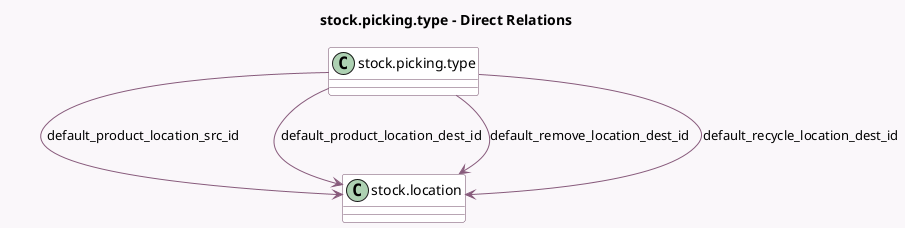

<!-- GENERATED:MODEL -->
---
tags: [odoo, community, generated, model]
---

# stock.picking.type

- Module: [[docs/Community Addons/repair/repair|repair]]
- Scope: Community Addons
- Defined in module: extension only
- Source files: `models/stock_picking.py`
- Python classes: `StockPickingType`

## Field footprint

- Detected fields: 10
- Field types: `Integer` x 4, `Many2one` x 4, `PropertiesDefinition` x 1, `Selection` x 1
- Relation fields: 4

## Sample fields

- `code`: `Selection`
- `count_repair_confirmed`: `Integer` (compute `_compute_count_repair`)
- `count_repair_late`: `Integer` (compute `_compute_count_repair`)
- `count_repair_ready`: `Integer` (compute `_compute_count_repair`)
- `count_repair_under_repair`: `Integer` (compute `_compute_count_repair`)
- `default_product_location_dest_id`: `Many2one` (comodel `stock.location`, compute `_compute_default_product_location_id`, store `True`)
- `default_product_location_src_id`: `Many2one` (comodel `stock.location`, compute `_compute_default_product_location_id`, store `True`)
- `default_recycle_location_dest_id`: `Many2one` (comodel `stock.location`, compute `_compute_default_recycle_location_dest_id`, store `True`)
- `default_remove_location_dest_id`: `Many2one` (comodel `stock.location`, compute `_compute_default_remove_location_dest_id`, store `True`)
- `repair_properties_definition`: `PropertiesDefinition` (comodel `Repair Properties`)

## Method hints

- Detected methods: 8
- Action methods: none
- Compute methods: `_compute_count_repair`, `_compute_default_location_dest_id`, `_compute_default_location_src_id`, `_compute_default_product_location_id`, `_compute_default_recycle_location_dest_id`, `_compute_default_remove_location_dest_id`
- Onchange methods: none

## Direct relation diagram

## Navigation

- **Parent:** [[docs/Community Addons/repair/Models]]

<!-- GENERATED:MODEL -->
