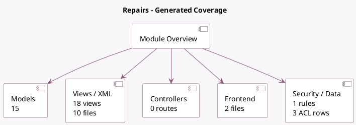

<!-- GENERATED:MODULE -->
---
tags: [odoo, community, module]
---

# Repairs

- Scope: Community Addons
- Source: odoo/addons/repair
- Dependencies: [[docs/Community Addons/sale_stock/sale_stock|sale_stock]], [[docs/Community Addons/sale_management/sale_management|sale_management]]

## Summary

Repair damaged products

## Generated coverage

- Models: 15
- XML files with UI/data artifacts: 10
- Views: 18
- Actions: 9
- Menus: 8
- Rules (ir.rule): 1
- Access CSV entries: 3
- Controller units: 0
- Frontend asset files: 2

## Module map

## Detail notes

- Models: [[docs/Community Addons/repair/Models|Models]] (15)
- Views and XML: [[docs/Community Addons/repair/Views|Views]] (10 files)
- Frontend: [[docs/Community Addons/repair/Frontend|Frontend]] (2 files)

## Key models

- `product.product`
- `product.template`
- `repair.order`
- `repair.tags`
- `sale.order`
- `sale.order.line`
- `stock.forecasted_product_product`
- `stock.lot`
- `stock.move`
- `stock.move.line`
- `stock.picking`
- `stock.picking.type`

## Navigation

- [[../Community Addons/Community Addons|Back to scope]]
- [[../../docs/docs|Back to docs]]

<!-- GENERATED:MODULE -->

