<!-- GENERATED:MODEL -->
---
tags: [odoo, community, generated, model]
---

# resource.calendar.attendance

- Module: [[docs/Community Addons/resource/resource|resource]]
- Scope: Community Addons
- Defined in module: yes
- Source files: `models/resource_calendar_attendance.py`
- Python classes: `ResourceCalendarAttendance`
- Description: Work Detail

## Field footprint

- Detected fields: 13
- Field types: `Boolean` x 2, `Char` x 1, `Float` x 4, `Integer` x 1, `Many2one` x 1, `Selection` x 4
- Relation fields: 1

## Sample fields

- `calendar_id`: `Many2one` (comodel `resource.calendar`)
- `day_period`: `Selection`
- `dayofweek`: `Selection`
- `display_type`: `Selection`
- `duration_based`: `Boolean` (related `calendar_id.duration_based`)
- `duration_days`: `Float` (compute `_compute_duration_days`, store `True`)
- `duration_hours`: `Float` (compute `_compute_duration_hours`, store `True`)
- `hour_from`: `Float`
- `hour_to`: `Float`
- `name`: `Char`
- `sequence`: `Integer`
- `two_weeks_calendar`: `Boolean` (comodel `Calendar in 2 weeks mode`, related `calendar_id.two_weeks_calendar`)
- `week_type`: `Selection`

## Method hints

- Detected methods: 9
- Action methods: none
- Compute methods: `_compute_display_name`, `_compute_duration_days`, `_compute_duration_hours`
- Onchange methods: `_onchange_hours`

## Direct relation diagram

```plantuml
@startuml
!define ODOO_COLOR_PRIMARY #714B67
!define ODOO_COLOR_ACCENT #875A7B
!define ODOO_COLOR_BG #FAF7FA

skinparam backgroundColor ODOO_COLOR_BG
skinparam defaultTextAlignment left
skinparam ArrowColor ODOO_COLOR_ACCENT
skinparam ClassBackgroundColor white
skinparam ClassBorderColor ODOO_COLOR_PRIMARY
skinparam ComponentBackgroundColor white
skinparam ComponentBorderColor ODOO_COLOR_PRIMARY
skinparam NoteBackgroundColor #FFF8FF
skinparam NoteBorderColor ODOO_COLOR_ACCENT
skinparam SequenceLifeLineBorderColor ODOO_COLOR_ACCENT
skinparam SequenceLifeLineBackgroundColor #FFFFFF
skinparam SequenceParticipantBorderColor ODOO_COLOR_PRIMARY
skinparam SequenceParticipantBackgroundColor #FFFFFF
skinparam sequence {
  ArrowColor ODOO_COLOR_ACCENT
  ActorBorderColor ODOO_COLOR_PRIMARY
}
title resource.calendar.attendance - Direct Relations
class "resource.calendar.attendance" as resource_calendar_attendance
class "resource.calendar" as resource_calendar
resource_calendar_attendance --> resource_calendar : calendar_id
@enduml
```

## Navigation

- **Parent:** [[docs/Community Addons/resource/Models]]

<!-- GENERATED:MODEL -->
