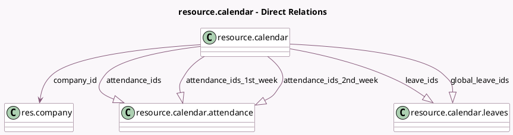

<!-- GENERATED:MODEL -->
---
tags: [odoo, community, generated, model]
---

# resource.calendar

- Module: [[docs/Community Addons/resource/resource|resource]]
- Scope: Community Addons
- Defined in module: yes
- Source files: `models/resource_calendar.py`
- Python classes: `ResourceCalendar`
- Description: Resource Working Time

## Field footprint

- Detected fields: 21
- Field types: `Boolean` x 5, `Char` x 3, `Float` x 4, `Integer` x 1, `Many2one` x 1, `One2many` x 5, `Selection` x 2
- Relation fields: 6

## Sample fields

- `active`: `Boolean` (comodel `Active`)
- `attendance_ids`: `One2many` (comodel `resource.calendar.attendance`, compute `_compute_attendance_ids`, store `True`)
- `attendance_ids_1st_week`: `One2many` (comodel `resource.calendar.attendance`, compute `_compute_two_weeks_attendance`)
- `attendance_ids_2nd_week`: `One2many` (comodel `resource.calendar.attendance`, compute `_compute_two_weeks_attendance`)
- `company_id`: `Many2one` (comodel `res.company`)
- `duration_based`: `Boolean` (comodel `Attendance based on duration`)
- `flexible_hours`: `Boolean` (compute `_compute_flexible_hours`, store `True`)
- `full_time_required_hours`: `Float` (compute `_compute_full_time_required_hours`, store `True`)
- `global_leave_ids`: `One2many` (comodel `resource.calendar.leaves`, compute `_compute_global_leave_ids`, store `True`)
- `hours_per_day`: `Float` (comodel `Average Hour per Day`, compute `_compute_hours_per_day`, store `True`)
- `hours_per_week`: `Float` (compute `_compute_hours_per_week`, store `True`)
- `is_fulltime`: `Boolean` (compute `_compute_work_time_rate`)
- `leave_ids`: `One2many` (comodel `resource.calendar.leaves`)
- `name`: `Char`
- `schedule_type`: `Selection`
- `two_weeks_calendar`: `Boolean`
- `two_weeks_explanation`: `Char` (comodel `Explanation`, compute `_compute_two_weeks_explanation`)
- `tz`: `Selection`
- `tz_offset`: `Char` (compute `_compute_tz_offset`)
- `work_resources_count`: `Integer` (comodel `Work Resources count`, compute `_compute_work_resources_count`)

## Method hints

- Detected methods: 44
- Action methods: none
- Compute methods: `_compute_attendance_ids`, `_compute_flexible_hours`, `_compute_full_time_required_hours`, `_compute_global_leave_ids`, `_compute_hours_per_day`, `_compute_hours_per_week`, `_compute_two_weeks_attendance`, `_compute_two_weeks_explanation`, and 3 more
- Onchange methods: `_onchange_attendance_ids`

## Direct relation diagram

## Navigation

- **Parent:** [[docs/Community Addons/resource/Models]]

<!-- GENERATED:MODEL -->
