<!-- GENERATED:MODEL -->
---
tags: [odoo, community, generated, model]
---

# resource.mixin

- Module: [[docs/Community Addons/resource/resource|resource]]
- Scope: Community Addons
- Defined in module: yes
- Source files: `models/resource_mixin.py`
- Python classes: `ResourceMixin`
- Description: Resource Mixin

## Field footprint

- Detected fields: 4
- Field types: `Many2one` x 3, `Selection` x 1
- Relation fields: 3

## Sample fields

- `company_id`: `Many2one` (comodel `res.company`, related `resource_id.company_id`, store `True`)
- `resource_calendar_id`: `Many2one` (comodel `resource.calendar`, related `resource_id.calendar_id`, store `True`)
- `resource_id`: `Many2one` (comodel `resource.resource`)
- `tz`: `Selection` (related `resource_id.tz`)

## Method hints

- Detected methods: 9
- Action methods: none
- Compute methods: none
- Onchange methods: none

## Direct relation diagram

```plantuml
@startuml
!define ODOO_COLOR_PRIMARY #714B67
!define ODOO_COLOR_ACCENT #875A7B
!define ODOO_COLOR_BG #FAF7FA

skinparam backgroundColor ODOO_COLOR_BG
skinparam defaultTextAlignment left
skinparam ArrowColor ODOO_COLOR_ACCENT
skinparam ClassBackgroundColor white
skinparam ClassBorderColor ODOO_COLOR_PRIMARY
skinparam ComponentBackgroundColor white
skinparam ComponentBorderColor ODOO_COLOR_PRIMARY
skinparam NoteBackgroundColor #FFF8FF
skinparam NoteBorderColor ODOO_COLOR_ACCENT
skinparam SequenceLifeLineBorderColor ODOO_COLOR_ACCENT
skinparam SequenceLifeLineBackgroundColor #FFFFFF
skinparam SequenceParticipantBorderColor ODOO_COLOR_PRIMARY
skinparam SequenceParticipantBackgroundColor #FFFFFF
skinparam sequence {
  ArrowColor ODOO_COLOR_ACCENT
  ActorBorderColor ODOO_COLOR_PRIMARY
}
title resource.mixin - Direct Relations
class "resource.mixin" as resource_mixin
class "res.company" as res_company
class "resource.calendar" as resource_calendar
class "resource.resource" as resource_resource
resource_mixin --> resource_resource : resource_id
resource_mixin --> res_company : company_id
resource_mixin --> resource_calendar : resource_calendar_id
@enduml
```

## Navigation

- **Parent:** [[docs/Community Addons/resource/Models]]

<!-- GENERATED:MODEL -->
