<!-- GENERATED:MODEL -->
---
tags: [odoo, community, generated, model]
---

# resource.resource

- Module: [[docs/Community Addons/resource/resource|resource]]
- Scope: Community Addons
- Defined in module: yes
- Source files: `models/resource_resource.py`
- Python classes: `ResourceResource`
- Description: Resources

## Field footprint

- Detected fields: 12
- Field types: `Boolean` x 2, `Char` x 3, `Float` x 1, `Image` x 1, `Many2one` x 3, `Selection` x 2
- Relation fields: 3

## Sample fields

- `active`: `Boolean` (comodel `Active`)
- `avatar_128`: `Image` (compute `_compute_avatar_128`)
- `calendar_id`: `Many2one` (comodel `resource.calendar`)
- `company_id`: `Many2one` (comodel `res.company`)
- `email`: `Char` (related `user_id.email`)
- `name`: `Char`
- `phone`: `Char` (related `user_id.phone`)
- `resource_type`: `Selection`
- `share`: `Boolean` (related `user_id.share`)
- `time_efficiency`: `Float` (comodel `Efficiency Factor`)
- `tz`: `Selection`
- `user_id`: `Many2one` (comodel `res.users`)

## Method hints

- Detected methods: 19
- Action methods: none
- Compute methods: `_compute_avatar_128`
- Onchange methods: `_onchange_company_id`, `_onchange_user_id`

## Direct relation diagram

```plantuml
@startuml
!define ODOO_COLOR_PRIMARY #714B67
!define ODOO_COLOR_ACCENT #875A7B
!define ODOO_COLOR_BG #FAF7FA

skinparam backgroundColor ODOO_COLOR_BG
skinparam defaultTextAlignment left
skinparam ArrowColor ODOO_COLOR_ACCENT
skinparam ClassBackgroundColor white
skinparam ClassBorderColor ODOO_COLOR_PRIMARY
skinparam ComponentBackgroundColor white
skinparam ComponentBorderColor ODOO_COLOR_PRIMARY
skinparam NoteBackgroundColor #FFF8FF
skinparam NoteBorderColor ODOO_COLOR_ACCENT
skinparam SequenceLifeLineBorderColor ODOO_COLOR_ACCENT
skinparam SequenceLifeLineBackgroundColor #FFFFFF
skinparam SequenceParticipantBorderColor ODOO_COLOR_PRIMARY
skinparam SequenceParticipantBackgroundColor #FFFFFF
skinparam sequence {
  ArrowColor ODOO_COLOR_ACCENT
  ActorBorderColor ODOO_COLOR_PRIMARY
}
title resource.resource - Direct Relations
class "resource.resource" as resource_resource
class "res.company" as res_company
class "res.users" as res_users
class "resource.calendar" as resource_calendar
resource_resource --> res_company : company_id
resource_resource --> res_users : user_id
resource_resource --> resource_calendar : calendar_id
@enduml
```

## Navigation

- **Parent:** [[docs/Community Addons/resource/Models]]

<!-- GENERATED:MODEL -->
