<!-- GENERATED:MODEL -->
---
tags: [odoo, community, generated, model]
---

# account.move.line

- Module: [[docs/Community Addons/sale/sale|sale]]
- Scope: Community Addons
- Defined in module: extension only
- Source files: `models/account_move_line.py`
- Python classes: `AccountMoveLine`

## Field footprint

- Detected fields: 3
- Field types: `Boolean` x 1, `Many2many` x 1, `Text` x 1
- Relation fields: 1

## Sample fields

- `is_downpayment`: `Boolean`
- `sale_line_ids`: `Many2many` (comodel `sale.order.line`)
- `sale_line_warn_msg`: `Text` (related `product_id.sale_line_warn_msg`)

## Method hints

- Detected methods: 10
- Action methods: none
- Compute methods: `_compute_is_storno`
- Onchange methods: none

## Direct relation diagram

```plantuml
@startuml
!define ODOO_COLOR_PRIMARY #714B67
!define ODOO_COLOR_ACCENT #875A7B
!define ODOO_COLOR_BG #FAF7FA

skinparam backgroundColor ODOO_COLOR_BG
skinparam defaultTextAlignment left
skinparam ArrowColor ODOO_COLOR_ACCENT
skinparam ClassBackgroundColor white
skinparam ClassBorderColor ODOO_COLOR_PRIMARY
skinparam ComponentBackgroundColor white
skinparam ComponentBorderColor ODOO_COLOR_PRIMARY
skinparam NoteBackgroundColor #FFF8FF
skinparam NoteBorderColor ODOO_COLOR_ACCENT
skinparam SequenceLifeLineBorderColor ODOO_COLOR_ACCENT
skinparam SequenceLifeLineBackgroundColor #FFFFFF
skinparam SequenceParticipantBorderColor ODOO_COLOR_PRIMARY
skinparam SequenceParticipantBackgroundColor #FFFFFF
skinparam sequence {
  ArrowColor ODOO_COLOR_ACCENT
  ActorBorderColor ODOO_COLOR_PRIMARY
}
title account.move.line - Direct Relations
class "account.move.line" as account_move_line
class "sale.order.line" as sale_order_line
account_move_line .. sale_order_line : sale_line_ids
@enduml
```

## Navigation

- **Parent:** [[docs/Community Addons/sale/Models]]

<!-- GENERATED:MODEL -->
