<!-- GENERATED:MODEL -->
---
tags: [odoo, community, generated, model]
---

# account.move

- Module: [[docs/Community Addons/sale/sale|sale]]
- Scope: Community Addons
- Defined in module: yes
- Source files: `models/account_move.py`
- Python classes: `AccountMove`
- Inherits: `utm.mixin`

## Field footprint

- Detected fields: 6
- Field types: `Integer` x 1, `Many2one` x 4, `Text` x 1
- Relation fields: 4

## Sample fields

- `campaign_id`: `Many2one`
- `medium_id`: `Many2one`
- `sale_order_count`: `Integer` (compute `_compute_origin_so_count`)
- `sale_warning_text`: `Text` (comodel `Sale Warning`, compute `_compute_sale_warning_text`)
- `source_id`: `Many2one`
- `team_id`: `Many2one` (comodel `crm.team`, compute `_compute_team_id`, store `True`)

## Method hints

- Detected methods: 15
- Action methods: `action_post`, `action_view_source_sale_orders`
- Compute methods: `_compute_origin_so_count`, `_compute_sale_warning_text`, `_compute_team_id`
- Onchange methods: none

## Direct relation diagram

```plantuml
@startuml
!define ODOO_COLOR_PRIMARY #714B67
!define ODOO_COLOR_ACCENT #875A7B
!define ODOO_COLOR_BG #FAF7FA

skinparam backgroundColor ODOO_COLOR_BG
skinparam defaultTextAlignment left
skinparam ArrowColor ODOO_COLOR_ACCENT
skinparam ClassBackgroundColor white
skinparam ClassBorderColor ODOO_COLOR_PRIMARY
skinparam ComponentBackgroundColor white
skinparam ComponentBorderColor ODOO_COLOR_PRIMARY
skinparam NoteBackgroundColor #FFF8FF
skinparam NoteBorderColor ODOO_COLOR_ACCENT
skinparam SequenceLifeLineBorderColor ODOO_COLOR_ACCENT
skinparam SequenceLifeLineBackgroundColor #FFFFFF
skinparam SequenceParticipantBorderColor ODOO_COLOR_PRIMARY
skinparam SequenceParticipantBackgroundColor #FFFFFF
skinparam sequence {
  ArrowColor ODOO_COLOR_ACCENT
  ActorBorderColor ODOO_COLOR_PRIMARY
}
title account.move - Direct Relations
class "account.move" as account_move
class "crm.team" as crm_team
account_move --> crm_team : team_id
@enduml
```

## Navigation

- **Parent:** [[docs/Community Addons/sale/Models]]

<!-- GENERATED:MODEL -->
