<!-- GENERATED:MODEL -->
---
tags: [odoo, community, generated, model]
---

# payment.transaction

- Module: [[docs/Community Addons/sale/sale|sale]]
- Scope: Community Addons
- Defined in module: extension only
- Source files: `models/payment_transaction.py`
- Python classes: `PaymentTransaction`

## Field footprint

- Detected fields: 2
- Field types: `Integer` x 1, `Many2many` x 1
- Relation fields: 1

## Sample fields

- `sale_order_ids`: `Many2many` (comodel `sale.order`)
- `sale_order_ids_nbr`: `Integer` (compute `_compute_sale_order_ids_nbr`)

## Method hints

- Detected methods: 10
- Action methods: `action_view_sales_orders`
- Compute methods: `_compute_reference_prefix`, `_compute_sale_order_ids_nbr`, `_compute_sale_order_reference`
- Onchange methods: none

## Direct relation diagram

```plantuml
@startuml
!define ODOO_COLOR_PRIMARY #714B67
!define ODOO_COLOR_ACCENT #875A7B
!define ODOO_COLOR_BG #FAF7FA

skinparam backgroundColor ODOO_COLOR_BG
skinparam defaultTextAlignment left
skinparam ArrowColor ODOO_COLOR_ACCENT
skinparam ClassBackgroundColor white
skinparam ClassBorderColor ODOO_COLOR_PRIMARY
skinparam ComponentBackgroundColor white
skinparam ComponentBorderColor ODOO_COLOR_PRIMARY
skinparam NoteBackgroundColor #FFF8FF
skinparam NoteBorderColor ODOO_COLOR_ACCENT
skinparam SequenceLifeLineBorderColor ODOO_COLOR_ACCENT
skinparam SequenceLifeLineBackgroundColor #FFFFFF
skinparam SequenceParticipantBorderColor ODOO_COLOR_PRIMARY
skinparam SequenceParticipantBackgroundColor #FFFFFF
skinparam sequence {
  ArrowColor ODOO_COLOR_ACCENT
  ActorBorderColor ODOO_COLOR_PRIMARY
}
title payment.transaction - Direct Relations
class "payment.transaction" as payment_transaction
class "sale.order" as sale_order
payment_transaction .. sale_order : sale_order_ids
@enduml
```

## Navigation

- **Parent:** [[docs/Community Addons/sale/Models]]

<!-- GENERATED:MODEL -->
